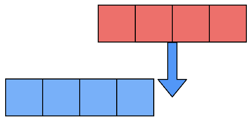

# java dev notes

### Java

#### foreach-loops

```java
class ForEachExample {
  public static void main(String[] args) {
    int[] primes = {2, 3, 5, 7, 11, 13};
    for(int p: primes) {
      System.out.println(p);
    }
  }
}
```

output:

```java
2
3
5
7
11
13
```

#### protected

1. 同一个包中：

   - protected 成员（字段、方法等）可以被同一包内的所有类访问。

2. 不同包中：

   - protected 成员可以被子类访问，即使这个子类在不同的包中。
   - 但是，子类只能通过继承的方式访问父类的 protected 成员，不能直接访问其他类的实例的 protected 成员。

#### field

类的成员变量被称作字段（fields）

static field

1. 静态字段（Static fields）：

   - 所有实例共享同一个字段。
   - 当一个实例修改静态字段时，这个修改会影响到所有其他实例。
   - 静态字段属于类本身，而不是单个实例。

2. 非静态字段（Non-static fields）：

   - 每个实例都有自己的字段副本。
   - 当一个实例修改其非静态字段时，只会影响该实例自己的字段值。
   - 其他实例的相同字段不会受到影响。

final field

一旦被赋值，final 字段的值就不能再被改变。

```java
class Car {
  // Final variable capacity
  final int capacity = 4;
}

class Demo {
   public static void main(String args[]) {
      Car car = new Car();
      car.capacity = 5; // Trying to change the capacity value
   }
}
```

output:

```java
main.java:9: error: cannot assign a value to final variable capacity car.capacity = 5; // Trying to change the capacity value ^ 1 error
```

#### func overloading

overloading：同名不同参。

多态（Polymorphism）是面向对象编程中一个非常重要的概念，而方法重载（overloading）在实现多态中扮演着至关重要的角色。

构造器就是典型例子。

构造器分类：Default constructor, parameterized constructor

> 如果你没有定义任何构造函数，Java 编译器会为你插入一个默认构造函数。因此，一旦类被编译，它至少会有一个无参数的构造函数。

#### this

在 Java 中，有几种情况下必须使用`this`关键字。

1. 区分局部变量和实例变量

当方法或构造函数的参数名与实例变量名相同时，必须使用`this`来明确指向实例变量。

```java
public class Person {
    private String name;

    public Person(String name) {
        this.name = name; // 必须使用this
    }
}
```

2. 在构造函数中调用另一个构造函数

当一个类有多个构造函数，并且想在一个构造函数中调用另一个构造函数时，必须使用`this()`。

```java
public class Rectangle {
    private int width, height;

    public Rectangle() {
        this(1, 1); // 调用另一个构造函数
    }

    public Rectangle(int width, int height) {
        this.width = width;
        this.height = height;
    }
}
```

3. 将当前对象作为参数传递

当需要将当前对象作为参数传递给另一个方法时，必须使用`this`。

```java
public class Node {
    private Node next;

    public void setNext(Node node) {
        node.next = this; // 将当前对象作为参数传递
    }
}
```

4. 返回当前对象以实现方法链

当想要实现方法链（method chaining）时，必须返回`this`。

```java
public class StringBuilder {
    private String str = "";

    public StringBuilder append(String s) {
        str += s;
        return this; // 返回当前对象以支持方法链
    }
}

// 使用: new StringBuilder().append("Hello").append(" ").append("World");
```

#### `super` in inheritance

超类(SuperClass)（父类(Parent Class)或基类(Base Class)）：这个类允许在另一个类中重用其非私有成员。  
子类(SubClass)（派生类(Child Class or Derived Class)）：这个类是从超类继承而来的。

子类的对象可以使用：
子类中定义的所有非私有成员，父类中定义的所有非私有成员。

> 有些类是不能继承的，比如 final 定义的类和内置的 Integer 类；
> 一个类一次只能继承自一个其他类，并且一个类不能继承自己。

1. 访问父类的字段

当子类和父类有同名字段时，使用 super 访问父类字段。

```java
class Parent {
    int x = 10;
}
class Child extends Parent {
    int x = 20;
    void printX() {
        System.out.println("子类的x: " + x);
        System.out.println("父类的x: " + super.x);
    }
}
```

2. 调用父类的方法

当子类重写了父类的方法，但仍需调用父类的该方法时。

```java
class Animal {
    void makeSound() {
        System.out.println("动物发出声音");
    }
}
class Dog extends Animal {
    void makeSound() {
        super.makeSound();  // 调用父类的方法
        System.out.println("狗吠叫");
    }
}
```

3. 调用父类的构造函数

在子类构造函数中调用父类的构造函数。

```java
class Vehicle {
    Vehicle(String type) {
        System.out.println("创建了一个" + type);
    }
}
class Car extends Vehicle {
    Car() {
        super("汽车");  // 调用父类的构造函数
    }
}
```

#### Inheritance type

##### Single Inheritance


```java
class Vehicle {          //Base Vehicle class

  private int topSpeed;
  public void setTopSpeed(int speed) {
    this.topSpeed=speed;
    System.out.println("The top speed is set to: "+ topSpeed);
  }

}

class Car extends Vehicle { // sub class Car extending from Vehicle

  public void openTrunk() {
    System.out.println("The Car trunk is Open Now");
  }

}

class Main {

  public static void main(String[] args) {
    Car corolla = new Car();
    corolla.setTopSpeed(220);
    corolla.openTrunk();
  }
```

output:

```java
The top speed is set to: 220
The Car trunk is Open Now
```

##### Multi-level Inheritance


```java
class Vehicle {          //Base Vehicle class

  private int topSpeed;

  public void setTopSpeed(int speed) {
    this.topSpeed=speed;
    System.out.println("The top speed is set to: "+ topSpeed);
  }

}

class Car extends Vehicle { // Derived from Vehicle Base for Prius

  public void openTrunk() {
    System.out.println("The Car trunk is Open Now!");
  }

}

class Prius extends Car {// Derived from Prius & can be base to any further class

  public void turnOnHybrid() {
    System.out.println("The Hybrid mode is turned on!");
  }

}

class Main {

  public static void main(String[] args) {
    Prius priusPrime = new Prius();
    priusPrime.setTopSpeed(220);
    priusPrime.openTrunk();
    priusPrime.turnOnHybrid();
  }

}
```

output:

```java
The top speed is set to: 220
The Car trunk is Open Now!
The Hybrid mode is turned on!
```

##### Hierarchical Inheritance


```java
class Vehicle {          //Base Vehicle class

  private int topSpeed;

  public void setTopSpeed(int speed) {
    this.topSpeed=speed;
    System.out.println("The top speed of "+getClass().getSimpleName()+" is set to: "+ topSpeed);
  }

}

class Car extends Vehicle { // Derived from Vehicle Base for Prius

  //implementation of Car class
}

class Truck extends Vehicle {// Derived from Prius can be base to any further class

  //implementation of Truck class
}

class Main {

  public static void main(String[] args) {
    Car corolla = new Car();
    corolla.setTopSpeed(220);

    Truck volvo = new Truck();
    volvo.setTopSpeed(120);
  }

}

```

output:

```java
The top speed of Car is set to: 220
The top speed of Truck is set to: 120
```

##### Multiple Inheritance


> Only applicable using interfaces in java.

eg:

```java
class Car {  // Base class

  private int model;  // Common features of all cars
  private String manufacturer;

  public Car(int model, String manufacturer) {  // Constructor
    this.model = model;
    this.manufacturer = manufacturer;
  }

  public void printDetails() {

    System.out.println("The model of " + getClass().getSimpleName() + " is: " + model);
    System.out.println("The manufacturer of " + getClass().getSimpleName() + " is: " + manufacturer);
  }

}  // End of Car class

interface IsSedan {  // Interface for sedans

  int bootSpace = 420;  // Sedans have boot space

  void bootSpace();    // Every sedan must implement this

}  // End of IsSedan interface

class Elantra extends Car implements IsSedan {  // Elantra is a Car and is a Sedan also

  private String variant;    // Elantra's data member

  public Elantra(int model, String variant) {  // Constructor
    super(model, "Hyundai");  // Calling the parent constructor with alredy known manufacturer
    this.variant = variant;
  }

  @Override
  public void bootSpace() { // Implementation of the interface method
    System.out.println("The bootspace of Elantra is: " + IsSedan.bootSpace +" litres");
  }

  @Override
  public void printDetails() {  // Overriding the parent class's inherited method
    super.printDetails();    // Calling the method from parent class
    System.out.println("The variant of Elantra is: " + variant); // printing the data member of this class
  }

}  // End of Elantra class


class Main {

  public static void main(String[] args) {

    Elantra sport = new Elantra(2019, "Sport");  //creating Sports variant Elantra
    Elantra eco = new Elantra(2018, "Eco");      //creating Eco variant Elantra

    sport.printDetails();
    sport.bootSpace();

    System.out.println();

    eco.printDetails();
    eco.bootSpace();
  }

}
```

##### Hybrid Inheritance


> Only applicable using interfaces in java.

#### overloading vs overriding

当然，我很乐意用例子来解释方法重载和方法重写的区别。让我们通过一些具体的代码示例来说明。

1. 方法重载（Method Overloading）：

方法重载是在同一个类中定义多个同名但参数不同的方法。

```java
public class Calculator {
    // 两个整数相加
    public int add(int a, int b) {
        return a + b;
    }

    // 三个整数相加
    public int add(int a, int b, int c) {
        return a + b + c;
    }

    // 两个浮点数相加
    public double add(double a, double b) {
        return a + b;
    }
}
```

在这个例子中，`add` 方法被重载了三次。编译器会根据传入的参数类型和数量来决定调用哪个方法。

使用示例：

```java
Calculator calc = new Calculator();
System.out.println(calc.add(5, 3));        // 调用第一个方法
System.out.println(calc.add(5, 3, 2));     // 调用第二个方法
System.out.println(calc.add(5.5, 3.2));    // 调用第三个方法
```

2. 方法重写（Method Overriding）：

方法重写是在子类中重新定义父类中已有的方法。

```java
public class Animal {
    public void makeSound() {
        System.out.println("动物发出声音");
    }
}

public class Dog extends Animal {
    @Override
    public void makeSound() {
        System.out.println("狗在汪汪叫");
    }
}

public class Cat extends Animal {
    @Override
    public void makeSound() {
        System.out.println("猫在喵喵叫");
    }
}
```

在这个例子中，`Dog` 和 `Cat` 类都重写了 `Animal` 类的 `makeSound` 方法。

使用示例：

```java
Animal animal1 = new Dog();
Animal animal2 = new Cat();

animal1.makeSound();  // 输出：狗在汪汪叫
animal2.makeSound();  // 输出：猫在喵喵叫
```

主要区别：

1. 重载发生在同一个类中，而重写发生在父子类之间。
2. 重载的方法名相同但参数不同，重写的方法名和参数都相同。
3. 重载是编译时多态（静态绑定），重写是运行时多态（动态绑定）。
4. 重载主要用于增加方法的灵活性，而重写用于实现多态性。

#### Polymorphism

静态多态性（Static polymorphism）也被称为编译时多态性。

动态多态性（Dynamic polymorphism）也被称为运行时多态性。

静态多态性：

1. 在编译时解析。
2. 被称为静态多态性。
3. 静态多态性使用方法重载。

动态多态性：

1. 在运行时解析。
2. 被称为动态多态性。
3. 动态多态性使用方法重写。

#### abstract & interface

| **Interfaces**                          | **Abstract Classes**                             |
| --------------------------------------- | ------------------------------------------------ |
| 支持多重继承                            | 不支持多重继承                                   |
| 所有成员都是  `public`的                | 可以有`private`, `protected`  和  `public`的成员 |
| 所有数据成员都是`static`  和  `final`的 | 不能有非静态和非最终的成员                       |
| 不能有构造器                            | 可以定义构造函数                                 |

抽象方法没有方法体或定义，它只能在抽象类或接口中声明。

非抽象类不能包含抽象方法，所以如果一个类的实现中包含任何抽象方法，那么这个类必须被声明为抽象类。

接口中的方法默认是 public abstract 的。

```java
// 抽象类中的抽象方法
abstract class Animal {
    // 抽象方法声明，注意没有方法体
    public abstract void makeSound();

    // 普通方法
    public void sleep() {
        System.out.println("Zzz...");
    }
}

// 接口中的抽象方法
interface Flyable {
    // 接口中的方法默认是public abstract的，可以省略这些修饰符
    void fly();
}

// 具体类实现抽象类和接口
class Bird extends Animal implements Flyable {
    // 实现抽象类中的抽象方法
    @Override
    public void makeSound() {
        System.out.println("Tweet tweet!");
    }

    // 实现接口中的抽象方法
    @Override // 如果你不实现flying()方法，你会得到一个错误！
    public void fly() {
        System.out.println("The bird is flying.");
    }
}

public class AbstractMethodExample {
    public static void main(String[] args) {
        Bird bird = new Bird();
        bird.makeSound();  // 输出：Tweet tweet!
        bird.sleep();      // 输出：Zzz...
        bird.fly();        // 输出：The bird is flying.
    }
}
```

类使用关键字 implements 来实现接口，而接口使用关键字 extends 来继承另一个接口

接口中声明或实现的所有方法默认都是`public`的，所有变量默认都是`public static final`的。

和抽象类一样，接口不能被实例化。

借口中不能有构造函数。

一个类不能继承多个 class，但能够 implements 多个接口。


接口不能声明为`public`或者`private`的。

接口中的 static 方法不能被重写。

##### functional interfaces

只有一个抽象方法的接口称为函数式接口。

使用@FunctionalInterface 注解的一定是 functional interface，而 functional interface 不一定使用@FunctionalInterface 注解。

```java
// 使用注解，一定是函数式接口
@FunctionalInterface
interface Example1 {
    void singleMethod();
}

// 没有注解，但实际上是函数式接口
interface Example2 {
    void singleMethod();
}

// 没有注解，不是函数式接口
interface Example3 {
    void method1();
    void method2();
}
```

#### Class relations

好的,我来为您解释这三种关系,并分别举例说明:

1. IS A (是一个)关系:

这是继承关系,表示一个类是另一个类的特殊类型。

例子:狗是动物

- 动物是一个基类
- 狗是动物的一个子类
- 狗继承了动物的所有基本特征,同时可能有自己特有的属性和方法

代码示例:

```python
class 动物:
    def 呼吸(self):
        print("我能呼吸")

class 狗(动物):
    def 吠叫(self):
        print("汪汪!")

小狗 = 狗()
小狗.呼吸()  # 继承自动物类
小狗.吠叫()  # 狗类特有的方法
```

2. PART-OF (部分-整体)关系:

这表示一个类是另一个类的组成部分,且生命周期完全依赖于整体。

例子:引擎是汽车的一部分

- 汽车是整体
- 引擎是汽车的一个组成部分
- 引擎的生命周期与汽车完全绑定,汽车被销毁时,引擎也就不存在了

代码示例:

```python
class 引擎:
    def 启动(self):
        print("引擎启动")

class 汽车:
    def __init__(self):
        self.引擎 = 引擎()

    def 行驶(self):
        self.引擎.启动()
        print("汽车开始行驶")

我的车 = 汽车()
我的车.行驶()
```

3. HAS-A (有一个)关系:

这是聚合关系,表示一个类拥有另一个类的对象,但它们的生命周期可以独立。

例子:人有一部手机

- 人是拥有者
- 手机是被拥有的对象
- 即使人不在了,手机还可以继续存在或被其他人使用

代码示例:

```python
class 手机:
    def 打电话(self):
        print("正在通话中")

class 人:
    def __init__(self, 手机=None):
        self.手机 = 手机

    def 使用手机(self):
        if self.手机:
            self.手机.打电话()
        else:
            print("没有手机可用")

小米手机 = 手机()
张三 = 人(小米手机)
张三.使用手机()

# 即使张三不在了,手机还可以被李四使用
李四 = 人(小米手机)
李四.使用手机()
```

##### Aggregation

aggregation 遵循 has-A 模型，其中一个类拥有另一个类的对象，二者的生命周期是独立的。


```java
class Country {

    private String name;
    private int population;

    public Country(String n, int p) {
      name = n;
      population = p;
    }
    public String getName() {
      return name;
    }

}

class Person {

    private String name;
    private Country country; // An instance of Country class

    public Person(String n, Country c) {
      name = n;
      country = c;
    }

    public void printDetails() {
      System.out.println("Name: " + name);
      System.out.println("Country: " + country.getName());
    }

}

class Main {

  public static void main(String args[]) {
    Country country = new Country("Utopia", 1);
    {
      Person user = new Person("Darth Vader", country);
      user.printDetails();
    }
    // The user object's lifetime is over

    System.out.println(country.getName()); // The country object still exists!
  }

}
```

##### Composition

composition 遵循 part-of 模型，其中一个类是另一个类的一部分，被拥有对象的生命周期依赖于拥有者的生命周期。

```java
class Engine {

  private int capacity;

  public Engine(){
    capacity = 0;
  }

  public Engine(int cap) {
    capacity = cap;
  }

  public void engineDetails() {
    System.out.println("Engine details: " + capacity);
  }

}

class Tires {

  private int noOfTires;

  public Tires() {
    noOfTires = 0;
  }

  public Tires(int nt) {
    noOfTires = nt;
  }

  public void tireDetails() {
    System.out.println("Number of tyres: " +  noOfTires);
  }

}

class Doors {

  private int noOfDoors;

  public Doors() {
    noOfDoors = 0;
  }

  public Doors(int nod) {
    noOfDoors = nod;
  }

  public void doorDetails() {
    System.out.println("Number of Doors: " + noOfDoors);
  }

}

class Car {

  private Engine eObj;
  private Tires tObj;
  private Doors dObj;
  private String color;

  public Car(String col, int cap, int nt, int nod) {
    this.eObj = new Engine(cap);;
    this.tObj = new Tires(nt);;
    this.dObj = new Doors(nod);

    color = col;
  }

  public void carDetail() {
    eObj.engineDetails();
    tObj.tireDetails();
    dObj.doorDetails();
    System.out.println("Car color: " + color);
  }

}

class Main {

  public static void main(String[] args) {
    Car cObj = new Car("Black", 1600, 4, 4);
    cObj.carDetail();
  }
}
```

### Recursion


- Literative

class MainClass {

```java
private static int factorialIterative(int n) {

  int factorialResult = 1;

  for (int i = 1; i <= n; i++) {
	factorialResult = factorialResult * i;
	}
  return factorialResult;

}

public static void main( String args ) {
	int result = factorialIterative(5);
	System.out.println("The factorial is: " + result);
	}
}
```

- Recursive

```java
class MainClass {

private static int factorialRecursive(int n) {

  if (n == 1) {
	return 1;
	}
  else {
	return (n * factorialRecursive(n-1));
}

}

public static void main( String args[] ) {
	int result = factorialRecursive(5);
	System.out.println("The factorial is: " + result);
	}
}
```

eg. recursion in linked list

```java
class Solution {
    /* Returns count of nodes in linked list */
    public static int lengthOfList(Node head) {
        if (head == null) {
            return 0;
        }
        return 1 + lengthOfList(head.next);
    }
}
```

#### Indiract Recursion(Mutual Recursion)

eg:

```java
class ExampleClass {

    static int n = 0;
    public static void indirectRecursiveFunction1() {
        if (n <= 20) {
            System.out.print(n + " ");
            n++;
            indirectRecursiveFunction2();
        }
        else {
            return;
        }
    }

    public static void indirectRecursiveFunction2() {
        if (n <= 20) {
            System.out.print(n + " ");
            n++;
            indirectRecursiveFunction1();
        }
        else {
            return;
        }
    }

    public static void main( String args[] ) {
        indirectRecursiveFunction1();
    }
}
```

#### Recursion with Numbers

##### Fibonacci

- Find the $n$ th

```java
class FibonacciClass {

    private static int fibonacci(int n) {
        // Base case
        if (n <= 1) {
            return n;
        }
        // Recursive case
        else {
            return (fibonacci(n-1) + fibonacci(n-2));
        }
    }

    public static void main( String args[] ) {
        int input = 5;
        System.out.println("Fibonacci sequence for the first " + input + " elements is:");

        // Loop to print all the fibonacci sequence elements
        int i = 0;
        while (i < input) {
            System.out.print(fibonacci(i) + " ");
            i++;
        }
    }
}
```

##### Greatest Common Devisor

**使用欧几里得算法**

欧几里得算法（也称辗转相除法）是计算最大公约数的高效算法。其核心思想是两个数的最大公约数等于较小的数和两数相除余数的最大公约数。

**代码如下：**

```java
public class Solution {
    public static int gcd(int num1, int num2) {
        if (num2 == 0) {
            return num1;
        } else {
            return gcd(num2, num1 % num2);
        }
    }
}
```

**欧几里得算法的原理：**

- **递归公式：** `gcd(a, b) = gcd(b, a % b)`
- **终止条件：**  当  `b == 0`  时，`gcd(a, 0) = a`

#### Recursion with Strings

##### String Reverse

```java
public static String reverseString(String myStr) {
        // Base case
        if (myStr.isEmpty()) {
            return myStr;
        }

        // Recursive case
        else {
		return reverseString(myStr.substring(1)) + myStr.charAt(0);
        }
    }
```

##### Remove Duplicate

```java
private static String remDuplicates(String text) {
        if (text.length() == 1) {
            return text;
        }

        if (text.substring(0,1).equals(text.substring(1,2))) {
            return remDuplicates(text.substring(1));
        }
        else {
            return text.substring(0,1) + remDuplicates(text.substring(1));
        }
    }
```

##### Find all Permutations

```java
class Solution {

    public static void permutations(char[] array, int length) {
        // 直接在这里调用排列生成函数，传入字符数组和起始下标0
        permutationsHelper(array, 0);
    }

    // 辅助函数用于生成排列
    private static void permutationsHelper(char[] array, int start) {
        if (start == array.length - 1) {
            // 当到达字符串的最后一个字符时，输出结果
            System.out.println(new String(array));
        } else {
            for (int i = start; i < array.length; i++) {
                swap(array, start, i); // 交换当前位置的字符
                permutationsHelper(array, start + 1); // 递归调用，移动到下一个字符
                swap(array, start, i); // 回溯，交换回来
            }
        }
    }

    // 辅助函数，用于交换数组中两个字符的位置
    private static void swap(char[] array, int i, int j) {
        char temp = array[i];
        array[i] = array[j];
        array[j] = temp;
    }

    public static void main(String args[]) {
        char[] input = {'a', 'b'};
        System.out.println("Permutations of a string");
        permutations(input, input.length); // 这里传入input和length
    }
}
```

递归思路：在每个循环中，我们首先固定第一个字符到当前位置，然后递归调用函数，将剩余的字符进行排列；每当排列完一个字符后，将固定的字符位置还原，依次固定后面的字符到当前位置；这样每一个字符在每个位置都会出现一次，从而包括了所有的排列。

#### Recursion with Arrays

##### First Occurrence

```java
class ArrayClass {

  private static int firstOccurrence(int[] a, int n, int currentIndex) {
    if (a.length == currentIndex) {
      return -1;
    }
    else if (a[currentIndex] == n) {
        return currentIndex;
    }
    else {
        return firstOccurrence(a, n, currentIndex+1);
    }
  }

  public static void main(String[] args) {
    System.out.print("{");

    int[] array = {2,3,4,1,7,8,3};
    for (int i = 0; i < array.length; i++) {
      System.out.print(array[i] + " ");
    }
    System.out.println("}");

    int num = 3;

    int result = firstOccurrence(array, num, 0);
    System.out.println("The first occurrence of the number " + num + " is at index: " + result);
  }
}
```

##### Reverse Array

- Literation

```java
import java.io.*;

class sample {

  private static void invert(int[] arr) {
    int s = arr.length/2;
    int tmp = arr.length-1;
    int tmp2 = 0;
    for (int i=0; i<s; i++) {
      tmp2 = arr[i];
      arr[i] = arr[tmp];
      arr[tmp] = tmp2;
      tmp = tmp - 1;
    }
  }

  public static void main(String[] args) {
    System.out.println("Hello world");

    int[] a = {5,4,3,2,1,0};
    System.out.print("{ ");
    for (int i = 0; i < a.length; i++) {
      System.out.print(a[i] + ", ");
    }
    System.out.print("} ");

    System.out.println(" ");

    invert(a);

    System.out.print("{ ");
    for (int i = 0; i < a.length; i++) {
      System.out.print(a[i] + ", ");
    }
    System.out.print("} ");

  }
}
```

- Recursion

```java
import java.io.*;

class ExampleClass {

  private static void invert(int[] array, int currentIndex) {
    if (currentIndex < array.length/2) {
      // swap array[currentIndex] and array[array.length-1-currentIndex]
      int temp = array[currentIndex];
      array[currentIndex] = array[array.length-1-currentIndex];
      array[array.length-1-currentIndex] = temp;

      invert(array, currentIndex+1);
    }
  }

  public static void main(String[] args) {
    System.out.println("Before: ");

    int[] array = {1,2,3,4,5,6,7};
    System.out.print("{ ");
    for (int i = 0; i < array.length; i++) {
      System.out.print(array[i] + " ");
    }
    System.out.println("} ");

    System.out.println("After: ");

    invert(array, 0);

    System.out.print("{ ");
    for (int i = 0; i < array.length; i++) {
      System.out.print(array[i] + " ");
    }
    System.out.print("} ");
  }
}
```

##### Sort Array

- Bubble Sort(Recursion)

```java
public class BubbleSort {

    // Method to implement bubble sort using recursion
    public static void bubbleSort(int[] arr, int n) {
        // Base case: If the size of the array is 1 or less, it is already sorted
        if (n == 1) {
            return;
        }

        // One pass of bubble sort. After this pass, the largest element
        // will be at the end of the array.
        for (int i = 0; i < n - 1; i++) {
            if (arr[i] > arr[i + 1]) {
                // Swap arr[i] and arr[i + 1]
                int temp = arr[i];
                arr[i] = arr[i + 1];
                arr[i + 1] = temp;
            }
        }

        // Recursive call for the remaining unsorted elements
        bubbleSort(arr, n - 1);
    }

    // Method to print the array
    public static void printArray(int[] arr) {
        for (int value : arr) {
            System.out.print(value + " ");
        }
        System.out.println();
    }

    // Main method to test the bubble sort
    public static void main(String[] args) {
        int[] arr = {64, 34, 25, 12, 22, 11, 90};
        System.out.println("Unsorted array:");
        printArray(arr);

        bubbleSort(arr, arr.length);

        System.out.println("Sorted array:");
        printArray(arr);
    }
}
```

#### Recursion with Data Structures

##### 反向打印链表

```java
class LinkedList {

    // Linked List Node
    static class Node {
      int value;
      Node next;
    };

    public static void reverse(Node head) {

      // Base case
      if (head == null) {
        return;
      }

      // Recursive case
      else {
        reverse(head.next);
        System.out.print(head.value + " ");
      }
    }

    static Node insertAtHead(Node temp_head, int new_value) {
      Node new_Node = new Node();
      new_Node.value = new_value;
      new_Node.next = (temp_head);
      (temp_head) = new_Node;

      return temp_head;
    }

    public static void main( String args[] ) {
        // Empty Linked List
        Node head = null;

        // Linked List = 1->2->3->4->5
        head = insertAtHead(head, 5);
        head = insertAtHead(head, 4);
        head = insertAtHead(head, 3);
        head = insertAtHead(head, 2);
        head = insertAtHead(head, 1);

        // Print the original Linked List
        System.out.println("Linked List: ");
        for (Node i = head; i != null; i = i.next) {
          System.out.print(i.value + " ");
        }

        // Print the reversed Linked List
        System.out.println(" ");
        System.out.println("Reversed Linked List: ");
        reverse(head);
    }
}
```

##### 遍历链表查找定值

```java
class Solution {
    public static boolean search(Node head, int num) {
      if(head==null){
        return false;
      } else if(head.value==num){
        return true;
      } else {
        head=head.next;
        return search(head,num);
      }

    }
}
```

##### 二叉树递归插值

[解释点击链接查看](https://www.educative.io/module/page/g5g3ywCmLqmMJ5YLr/10370001/4830990535491584/6299919900475392)

```java
class binarySearchTree {

	//Variables
	private Node root;
	//Getter for Root
	public Node getRoot() {
		return root;
	}
  //Setter for root
  public void setRoot(Node root) {
		this.root = root;
	}


	//Recursive function to insert a value in BST
	public Node recursive_insert(Node currentNode, int value) {

		//Base Case
		if (currentNode == null) {
			return new Node(value);
		}

		if (value < currentNode.getData()) {
			//Iterate left sub-tree
			currentNode.setLeftChild(recursive_insert(currentNode.getLeftChild(), value));
		} else if (value > currentNode.getData()) {
			//Iterate right sub-tree
			currentNode.setRightChild(recursive_insert(currentNode.getRightChild(), value));
		} else {
			// value already exists
			return currentNode;
		}

		return currentNode;
	}

	//Function to call recursive insert
	public boolean insert(int value) {

		root = recursive_insert(this.root, value);
		return true;
	}

	//Function to check if Tree is empty or not
	public boolean isEmpty() {
		return root == null; //if root is null then it means Tree is empty
	}

	//Just for Testing purpose
	public void printTree(Node current) {

		if (current == null) return;

		System.out.print(current.getData() + ",");
		printTree(current.getLeftChild());
		printTree(current.getRightChild());

	}
	public static void main(String args[]) {

		binarySearchTree bsT = new binarySearchTree();
		bsT.insert(6);
		bsT.insert(4);
		bsT.insert(8);
		bsT.insert(5);
		bsT.insert(2);
		bsT.insert(8);
		bsT.insert(12);
		bsT.insert(10);
		bsT.insert(14);
		bsT.printTree(bsT.getRoot());

	}
}
```

##### 有向图深度优先遍历

深度优先搜索

[可视化递归过程](https://www.educative.io/module/page/g5g3ywCmLqmMJ5YLr/10370001/4830990535491584/5232151308533760)

```java
class ExampleClass {

    static class Graph {
        int numVertices;
        LinkedList<Integer>[] tempList;

        Graph(int numVertices) {
            this.numVertices = numVertices;
            tempList = new LinkedList[numVertices];
            for (int i = 0; i < numVertices ; i++) {
                tempList[i] = new LinkedList<>();
            }
        }

        // Method to add an edge between 2 nodes in the Graph
        // fromNode 2 toNode 5 ==> 2 -> 5
        public void addEgde(int fromNode, int toNode) {
            tempList[fromNode].addFirst(toNode);
        }

        public void DFSRecursion(int startVertex) {
            boolean[] visitedArr = new boolean[numVertices];
            dfs(startVertex, visitedArr);
        }

        // DFS Recursion takes place here
        public void dfs(int start, boolean [] visitedArr) {
            visitedArr[start] = true;

            System.out.print(start + " ");

            for (int i = 0; i < tempList[start].size(); i++) {
                int toNode = tempList[start].get(i);
                if (!visitedArr[toNode])
                    dfs(toNode,visitedArr);
            }
        }
    }

    public static void main( String args[] ) {
        System.out.println( "Your DFS path is: " );

        int nVertices = 6;

        Graph g = new Graph(nVertices);

        g.addEgde(0, 1);
        g.addEgde(0, 2);
        g.addEgde(1, 3);
        g.addEgde(1, 4);
        g.addEgde(2, 5);

        // Root node given as argument to the function
        g.DFSRecursion(0);
    }
}
```

##### 拓扑排序

拓扑排序是一种对有向无环图进行排序的方法。

## Multithreading

### 多线程基础

#### 进程和线程

- 进程

进程是正在执行的程序。进程是一个执行环境，由指令、用户数据和系统数据段组成，还有许多其他资源，比如运行时获取的 CPU、内存、地址空间、磁盘和网络 I/O。一个程序可以同时有多个副本在运行，但一个进程必然只属于一个程序。

- 线程

线程是进程中最小的执行单元。线程按顺序执行指令。一个进程可以有多个线程同时运行。通常，进程会有一些状态在所有线程之间共享，同时每个线程也会有一些私有状态。进程中线程之间共享的全局状态对所有线程是可见和可访问的，当任何线程尝试读取或写入这个全局共享状态时，需要进行格外的操作。


#### 并发与并行

- Series Execution

执行完一个程序再执行下一个程序。

类比马戏团的小丑同时只抛一个球。

- Concurrence

在重叠的时间区间内运行多个独立程序或多个相同程序的独立单元。

类比马戏团的小丑同时抛多个球。

- Parallelism

能够同时执行多个程序。

类比马戏团的小丑同时抛多个球并且同时骑车。

**并发系统不是并行系统，但并行系统是并发系统。**

#### 抢占式 & 协作式

Cooperative Multitasking vs Preemptive Multitasking

抢占式多任务允许操作系统中断一个程序,转而执行另一个等待的任务,而协作式多任务则要求表现良好的程序自愿将控制权交给调度器。抢占式多任务提供更可预测和可靠的调度,因为操作系统决定何时切换任务,而协作式多任务则依赖于程序的相互配合才能实现调度。早期版本的 Windows 和 Mac OS 使用协作式多任务,但后来版本引入了抢占式多任务,这一直是基于 Unix 系统的核心特性。

#### Synchronous & Asynchronous

同步执行指逐行执行代码。如果调用一个函数,程序执行将等待直到函数调用完成。同步执行在继续下一行代码之前,会阻塞在每个方法调用处。程序按照源代码文件中的顺序执行。同步执行等同于串行执行。

异步执行可以调用一个方法,然后继续执行下一行代码,而不需要等待被调用的函数完成或返回结果。通常,这种方法会返回一个被称为 future 或 promise 的实体,它代表一个正在进行的计算。程序可以通过返回的 future 或 promise 查询计算的状态,并在计算完成时获取结果。另一种模式是向异步函数调用传递一个回调函数,当异步函数处理完成时,会调用这个回调函数并传递结果。

#### Critical Sections & Race Conditions

- 临界区

临界区是应用程序中可能被多个线程并发执行,并且暴露了应用程序使用的任何共享数据或资源的任何代码部分。

- 竞态条件

竞态条件发生在线程在没有线程同步的情况下穿过临界区时。线程"竞争"通过临界区来读写共享资源,根据线程完成"竞争"的顺序,程序的输出会发生变化。在竞态条件下,线程访问可能被其他线程同时操作的共享资源或程序变量,从而导致应用程序数据不一致。

#### Deadlocks, Liveness & Reentrant Locks

- 死锁

死锁发生在两个或多个线程无法取得任何进展,因为第一个线程所需的资源被第二个线程持有,而第二个线程所需的资源又被第一个线程持有。

- 活锁

活锁发生在两个线程不断地根据对方的行为做出反应,却没有取得任何实质性进展。最好的类比是想象两个人在走廊里试图穿过对方。John 向左移动让 Arun 通过,而 Arun 向右移动让 John 通过。现在两人都堵住了对方。John 看到他又在阻碍 Arun,于是向右移动,Arun 看到他又在阻碍 John,于是向左移动。他们永远无法穿过对方,一直在相互阻挡。这种情况就是活锁的例子。一个进程似乎在运行而不是死锁,但实际上并没有取得任何进展。

- Starvation

除了死锁,应用程序线程也可能遭遇饥饿,即永远无法获得 CPU 时间或访问共享资源。其他贪婪的线程不断垄断共享系统资源,不让挨饿的线程取得任何进展。

##### 死锁

以下是一个典型的死锁的抽象例子：

```java
void increment(){

acquire MUTEX_A

acquire MUTEX_B

// do work here

release MUTEX_B

release MUTEX_A

}

void decrement(){

acquire MUTEX_B

acquire MUTEX_A

// do work here

release MUTEX_A

release MUTEX_B

}
```

```java
T1 enters function increment

T1 acquires MUTEX_A

T1 gets context switched by the operating system

T2 enters function decrement

T2 acquires MUTEX_B

both threads are blocked now
```

以下是一个死锁的代码实例：

```java
class Demonstration {

    public static void main(String args[]) {
        Deadlock deadlock = new Deadlock();
        try {
            deadlock.runTest();
        } catch (InterruptedException ie) {
        }
    }
}

class Deadlock {

    private int counter = 0;
    private Object lock1 = new Object();
    private Object lock2 = new Object();

    Runnable incrementer = new Runnable() {

        @Override
        public void run() {
            try {
                for (int i = 0; i < 100; i++) {
                    incrementCounter();
                    System.out.println("Incrementing " + i);
                }
            } catch (InterruptedException ie) {
            }
        }
    };

    Runnable decrementer = new Runnable() {

        @Override
        public void run() {
            try {
                for (int i = 0; i < 100; i++) {
                    decrementCounter();
                    System.out.println("Decrementing " + i);
                }
            } catch (InterruptedException ie) {
            }

        }
    };

    public void runTest() throws InterruptedException {

        Thread thread1 = new Thread(incrementer);
        Thread thread2 = new Thread(decrementer);

        thread1.start();
        // sleep to make sure thread 1 gets a chance to acquire lock1
        Thread.sleep(100);
        thread2.start();

        thread1.join();
        thread2.join();

        System.out.println("Done : " + counter);
    }

    void incrementCounter() throws InterruptedException {
        synchronized (lock1) {
            System.out.println("Acquired lock1");
            Thread.sleep(100);

            synchronized (lock2) {
                counter++;
            }
        }
    }

    void decrementCounter() throws InterruptedException {
        synchronized (lock2) {
            System.out.println("Acquired lock2");

            Thread.sleep(100);
            synchronized (lock1) {
                counter--;
            }
        }
    }
}
```

##### NonReentrant Lock

可重入锁(ReentrantLock)是 Java 中的一种特殊的锁实现,它允许同一个线程多次获取同一个锁,而不会造成死锁。

以下是一个不可重入锁的例子：

```java
class Demonstration {

    public static void main(String args[]) throws Exception {
        NonReentrantLock nreLock = new NonReentrantLock();

        // First locking would be successful
        nreLock.lock();
        System.out.println("Acquired first lock");

        // Second locking results in a self deadlock
        System.out.println("Trying to acquire second lock");
        nreLock.lock();
        System.out.println("Acquired second lock");
    }
}

class NonReentrantLock {

    boolean isLocked;

    public NonReentrantLock() {
        isLocked = false;
    }

    public synchronized void lock() throws InterruptedException {

        while (isLocked) {
            wait();
        }
        isLocked = true;
    }

    public synchronized void unlock() {
        isLocked = false;
        notify();
    }
}

```

#### Mutex vs Semaphore

- 互斥锁

互斥锁用于实现互斥，保护共享数据。

互斥锁仅允许一个线程访问资源或临界区，一旦一个线程获得了互斥锁,所有其他试图获取同一个互斥锁的线程都会被阻塞,直到第一个线程释放锁。一旦释放,大多数实现都会随机选择一个等待的线程来获取互斥锁并继续执行。


- 信号量

信号量用于限制对资源集合的访问。

可以把信号量想象成有限数量的许可证。如果一个信号量已经发放了所有的许可证,那么任何新来请求许可证的线程都会被阻塞,直到之前持有许可证的线程归还。一个典型的例子就是数据库连接池,有 10 个可用连接但有 50 个请求线程。在这种情况下,信号量在任何给定时间点只能发放 10 个许可证或连接。

- Mutex vs Binary Semaphore

只有一个许可证的信号量被称为二元信号量,通常被认为等同于互斥锁,但这不完全正确,我们稍后会解释。信号量也可以用于线程之间的信号传递。这是一个重要的区别,因为它允许线程协作完成一项任务。而互斥锁则严格限于对竞争线程之间的共享状态进行串行化访问。

信号量如果允许的许可数量设置为 1，就可以充当互斥锁。然而，两者之间最重要的区别在于，互斥锁必须由同一个线程调用获取和后续释放，而在二进制信号量的情况下，不同的线程可以调用获取和释放信号量。pthreads 库文档在 pthread_mutex_unlock()方法的描述中提到了这一点。

> 如果一个线程尝试解锁一个它没有锁定过的互斥锁，或者一个已经解锁的互斥锁，就会产生未定义的行为。

这引出了 **所有权(Ownership)** 的概念。互斥锁由获取它的线程拥有，直到拥有线程释放它，而信号量则没有所有权的概念。

Mutex lock:


Semaphore:


#### Monitor

- Condition Variables

1. 当消费者线程调用 `wait()` 方法时,它会先释放掉手中的互斥锁。这样其他线程就有机会获取锁,访问共享资源。

2. 消费者线程在调用 `wait()` 之后,就进入了等待状态,不会占用 CPU 资源。系统会把这个线程挂起,直到某个时候被唤醒。

3. 当生产者线程往仓库添加商品时,它会调用 `signal()` 方法,通知等待队列中的某个消费者线程可以去取货了。

4. 被唤醒的消费者线程会再次尝试获取互斥锁,一旦获取成功,就可以继续执行取货的操作。

相比之下,如果消费者线程不使用条件变量,而是采用自旋等待的方式,它就需要不断检查仓库的状态,占用 CPU 资源。这种方式效率较低,尤其是在多核 CPU 上会导致严重的资源浪费。
所以条件变量可以让线程安全地进入休眠状态,直到条件满足时被唤醒,从而大大提高了系统的并发性和效率。

Example:

```java
voidefficientWaitingFunction() // 等待区
{
  mutex.acquire()
  while (predicate == false) {
    condVar.wait()
  }
 // Do something useful
  mutex.release()
}

void changePredicate(){ //入口区
  mutex.acquire()
  set predicate = true
  condVar.signal()
  mutex.release()
}
```

- Monitor

监视器是由一个互斥锁和一个或多个条件变量组成的实体。监视器可以看作是有两个集合的容器:

1. 入口集合 - 当线程试图进入监视器时,它会被加入到这个集合中。
2. 等待集合 - 当线程在监视器内部调用  `wait()`  方法时,它会被移动到这个集合中进入等待状态。

当一个线程成功获取了监视器的锁时,它就成为了监视器的所有者。作为所有者,该线程可以在监视器的临界区内执行操作。其他试图进入监视器的线程,会被加入到入口集合中等待。

如果一个线程在监视器内部调用了  `wait()`  方法,它会释放掉监视器的锁,然后被移动到等待集合中。此时,入口集合中的另一个线程可以获取锁,成为新的监视器所有者。

当一个线程调用  `signal()`  方法时,它会唤醒等待集合中的一个线程,让其重新尝试获取监视器的锁。

- synchronized

在锁定监视器的情况下,才能调用 wait()和 notify()/notifyAll()方法。

1. 进入 synchronized 代码块或 synchronized 方法后,当前线程成为该对象的监视器所有者。
2. 只有在成为监视器所有者的情况下,才能调用该对象的 wait()、notify()和 notifyAll()方法。
3. 调用 wait()方法后,当前线程会释放掉监视器的锁,并进入该对象的等待集合中。
4. 其他线程获取到该监视器的锁后,可以调用 notify()/notifyAll()方法来唤醒等待集合中的一个/所有线程。
5. 被唤醒的线程会重新尝试获取监视器的锁,一旦获取成功,就可以继续执行。

总之,只有在成为监视器所有者的情况下,才能安全地调用 wait()、notify()和 notifyAll()方法,否则会抛出 IllegalMonitorStateException 异常。

###### Bad Synchronization Example

没有在同步块中调用 wait()和 notify()方法

```java
class BadSynchronization {

    public static void main(String args[]) throws InterruptedException {
        Object dummyObject = new Object();

        // Attempting to call wait() on the object
        // outside of a synchronized block.
        dummyObject.wait();
    }
}
```

没有在对应的对象上调用 wait()和 notify()方法

```java
class BadSynchronization {

    public static void main(String args[]) {
        Object dummyObject = new Object();
        Object lock = new Object();

        synchronized (lock) {
            lock.notify();

            // Attempting to call notify() on the object
            // in synchronized block of another object
            dummyObject.notify();
        }
    }
}
```

##### Hoare vs Mesa Monitors

在 Mesa 式监视器中(Mesa 是 Xerox 公司在 1970 年代开发的一种语言)可能会出现这样的情况:在线程 B 调用 notify()并释放其互斥锁与休眠的线程 A 醒来并重新获取互斥锁之间,条件又被另一个线程改回了 false。被唤醒的线程 A 需要与其他线程竞争以获取互斥锁,因为信号发送线程 B 还没有完全释放监视器。在发送信号后,线程 B 并没有立即放弃监视器的所有权,而是一直保持到退出监视器代码块。

相比之下,在 Hoare 式监视器中(Hoare 是最初的监视器设计者之一),信号发送线程 B 会将监视器的所有权让渡给被唤醒的线程 A,而线程 B 则会被挂起。这样就保证了条件不会被改变,因此使用 if 语句就足够了,而不需要用 while 循环来检查条件。被唤醒/释放的线程 A 会立即开始执行,因为信号发送线程 B 已经表示条件发生了改变。其他线程没有机会进入监视器修改条件。

Java 采用的是 Mesa 式监视器语义,开发者总是需要在 while 循环中检查条件/谓词。Mesa 式监视器比 Hoare 式监视器更高效。

#### Amdahl's Law

$$
S(n) = \frac{1}{(1 - P) + \frac{P}{n}}
$$

- **S(n)**  是使用  *n*  个核心或线程所获得的加速效果。
- **P**  是程序中可以并行处理的部分比例。
- **(1 - P)**  是程序中必须串行执行的部分比例。


随着 N 趋近无穷大,Amdahl's 定律采取以下形式:

S(n) = 1 / (1 - P) = 1 / 程序中串行执行的部分

如果公式给出 5 倍的速率提升,这并不意味着现实中会观察到类似的加速。还有其他因素,如内存体系结构、缓存失误、网络和磁盘 I/O 等,可能会影响程序的执行时间,实际加速可能小于计算出的结果。

Amdahl's 定律适用于固定大小的问题。

### Multithreading in Java

#### 同步块 & 同步方法

1. 同步块(Synchronized Blocks):

   - 使用 `synchronized` 关键字可以创建同步块,用于保护临界区代码,确保同一时间只有一个线程能访问该代码。
   - 同步块是针对特定的对象进行同步的,通常使用 `this` 关键字来引用当前对象。也可以使用其他对象作为同步锁。
   - 同步块可以出现在任何方法中,也可以分散在不同的方法、类或整个代码库中。
   - 同步块可以被重复进入,即同一个线程可以多次获取同一个对象的监视器锁。

2. 同步方法(Synchronized Methods):

   - 使用 `synchronized` 关键字修饰方法可以将整个方法声明为同步方法。
   - 同步方法隐式地获取和释放对象的监视器锁,即同一个线程将获取和释放同一个监视器锁。
   - 对于静态方法,监视器锁是该类的 Class 对象;对于实例方法,监视器锁是 `this` 对象。
   - 如果同步方法中抛出了未捕获的异常,监视器锁仍然会被释放。

3. 差异:
   - 同步块可以更细粒度地控制同步,可以针对特定的对象进行同步,而同步方法是针对整个方法进行同步。
   - 同步块可以在不同的方法中分别获取和释放监视器锁,而同步方法必须在同一个方法内隐式地获取和释放监视器锁。
   - 同步块更灵活,可以在不同的方法或线程中分别获取/释放锁,而同步方法则要求同一个线程获取和释放同一个监视器锁。

使用不同监视器锁的例子

```java
class Employee {

    // shared variable
    private String name;

    // method is synchronize on 'this' object
    public synchronized void setName(String name) {
        this.name = name;
    }

    // also synchronized on the same object
    public synchronized void resetName() {

        this.name = "";
    }

    // equivalent of adding synchronized in method
    // definition
    public String getName() {
        synchronized (this) {
            return this.name;
        }
    }
}
```

这里使用的同步锁是  `this`  对象,也就是  `Employee`  类的实例对象。这意味着:

1. 这个同步块与  `setName()`  和  `resetName()`  方法使用的同一个监视器锁(即  `this`  对象)。
2. 同一个  `Employee`  实例上的所有同步代码块和同步方法都使用同一个监视器锁。

```java
class Employee {

    // shared variable
    private String name;
    private Object lock = new Object();

    // method is synchronize on 'this' object
    public synchronized void setName(String name) {
        this.name = name;
    }

    // also synchronized on the same object
    public synchronized void resetName() {

        this.name = "";
    }

    // equivalent of adding synchronized in method
    // definition
    public String getName() {
        // Using a different object to synchronize on
        synchronized (lock) {
            return this.name;
        }
    }
}
```

这里使用的同步锁是一个专门创建的  `Object`  实例  `lock`。这意味着:

1. `getName()`  方法使用的监视器锁是  `lock`  对象,与  `setName()`  和  `resetName()`  方法使用的  `this`  对象监视器锁不同。
2. 同一个  `Employee`  实例的其他同步代码块和方法不会受到  `getName()`  方法的影响,因为它们使用的是不同的监视器锁。

错误示例：

```java
class Demonstration {
    public static void main( String args[] ) throws InterruptedException {
        IncorrectSynchronization.runExample();
    }
}

class IncorrectSynchronization {

    Boolean flag = new Boolean(true);

    public void example() throws InterruptedException {

        Thread t1 = new Thread(new Runnable() {

            public void run() {
                synchronized (flag) {
                    try {
                        while (flag) {
                            System.out.println("First thread about to sleep");
                            Thread.sleep(5000);
                            System.out.println("Woke up and about to invoke wait()");
                            flag.wait();
                        }
                    } catch (InterruptedException ie) {

                    }
                }
            }
        });

        Thread t2 = new Thread(new Runnable() {

            public void run() {
                flag = false;
                System.out.println("Boolean assignment done.");
            }
        });

        t1.start();
        Thread.sleep(1000);
        t2.start();
        t1.join();
        t2.join();
    }

    public static void runExample() throws InterruptedException {
        IncorrectSynchronization incorrectSynchronization = new IncorrectSynchronization();
        incorrectSynchronization.example();
    }
}
```

错误原因：生产者和消费者在访问同一个资源时没有使用同一个监视器锁

正确示例：

```java
class IncorrectSynchronization {

    private Boolean flag = true;
    private final Object lock = new Object();

    public void example() throws InterruptedException {

        Thread t1 = new Thread(() -> {
            synchronized (lock) {
                try {
                    while (flag) {
                        System.out.println("First thread about to sleep");
                        Thread.sleep(5000);
                        System.out.println("Woke up and about to invoke wait()");
                        lock.wait();
                    }
                } catch (InterruptedException ie) {
                    // Handle interruption
                }
            }
        });

        Thread t2 = new Thread(() -> {
            synchronized (lock) {
                flag = false;
                System.out.println("Boolean assignment done.");
                lock.notifyAll();
            }
        });

        t1.start();
        Thread.sleep(1000);
        t2.start();
        t1.join();
        t2.join();
    }

    public static void runExample() throws InterruptedException {
        IncorrectSynchronization incorrectSynchronization = new IncorrectSynchronization();
        incorrectSynchronization.example();
    }
}
```

#### Interrupting Threads

```java
class Demonstration {

    public static void main(String args[]) throws InterruptedException {
        InterruptExample.example();
    }
}

class InterruptExample {

    static public void example() throws InterruptedException {

        final Thread sleepyThread = new Thread(new Runnable() {

            public void run() {
                try {
                    System.out.println("I am too sleepy... Let me sleep for an hour.");
                    Thread.sleep(1000 * 60 * 60);
                } catch (InterruptedException ie) {
                    System.out.println("The interrupt flag is cleard : " + Thread.interrupted() + " " + Thread.currentThread().isInterrupted());
                    Thread.currentThread().interrupt();
                    System.out.println("Oh someone woke me up ! ");
                    System.out.println("The interrupt flag is set now : " + Thread.currentThread().isInterrupted() + " " + Thread.interrupted());

                }
            }
        });

        sleepyThread.start();

        System.out.println("About to wake up the sleepy thread ...");
        sleepyThread.interrupt();
        System.out.println("Woke up sleepy thread ...");

        sleepyThread.join();
    }
}


```

Output:

```java
About to wake up the sleepy thread ...
Woke up sleepy thread ...
I am too sleepy... Let me sleep for an hour.
The interrupt flag is cleard : false false
Oh someone woke me up !
The interrupt flag is set now : true true
```

当 `sleepyThread` 被中断时，它的中断标志被设置为 `true`，但同时抛出 `InterruptedException`，这意味着线程的中断标志已经被**自动清除**。因此，在 `catch (InterruptedException ie)` 块中，`Thread.interrupted()` 返回的是 `false`，因为中断标志已在异常抛出时被清除。

**第一组：The interrupt flag is cleard: false false**

• 这里调用了 Thread.interrupted() 和 Thread.currentThread().isInterrupted()，两个都返回 false。原因如下：

• Thread.interrupted() 返回 false，因为线程的中断标志在抛出 InterruptedException 时被自动清除。

• Thread.currentThread().isInterrupted() 返回 false，因为抛出 InterruptedException 后，中断标志同样被清除。

**第二组：The interrupt flag is set now: true true**

• 在捕获异常后，代码手动调用了 Thread.currentThread().interrupt()，这会重新设置线程的中断标志。

• 因此，接下来的 Thread.interrupted() 返回 true，因为中断标志已经被重新设置。

• 而 Thread.currentThread().isInterrupted() 也返回 true，因为此时线程的中断标志是设置状态，并且不会被清除。

**总结**

• Thread.interrupted() 会清除当前线程的中断标志，所以在异常抛出后第一次调用时，它返回 false，因为标志已经被清除。

• Thread.currentThread().isInterrupted() 检查线程的中断标志，但不会清除标志，所以在抛出异常后第一次调用时，也返回 false，因为标志已被清除。

• 手动调用 Thread.currentThread().interrupt() 重新设置中断标志，之后的检查都会返回 true。

#### Volatile

缓存一致性可能存在的问题

```java】
public class VolatileExample {

    boolean flag = false;

    void threadA() {
        while (!flag) {
            // ... Do something useful
        }
    }

    void threadB() {
        flag = true;
    }
}
```

**缓存一致性**：CPU 为了提高性能，会将数据从主内存加载到缓存中，因为缓存的访问速度比主内存快得多。每个 CPU 核心通常有自己的缓存，因此不同的线程（在不同的核心上运行）可能会读取到不同的  `flag`  值，这会导致状态不一致。

```java
class Demonstration {

    // volatile doesn't imply thread-safety!
    static volatile int count = 0;

    public static void main(String[] args) throws InterruptedException {

        int numThreads = 10;
        Thread[] threads = new Thread[numThreads];

        for (int i = 0; i < numThreads; i++) {
            threads[i] = new Thread(new Runnable() {
                @Override
                public void run() {
                    for (int i = 0; i < 1000; i++)
                        count++;
                }
            });
        }

        for (int i = 0; i < numThreads; i++) {
            threads[i].start();
        }

        for (int i = 0; i < numThreads; i++) {
            threads[i].join();
        }

        System.out.println("count = " + count);
    }
}
```

这段代码展示了一个多线程的示例，目的是演示 `volatile` 关键字并不意味着线程安全。具体来说：

1. 定义了一个静态的 `volatile` 整数变量 `count`，初始值为 0。
2. 在 `main` 方法中，创建了 10 个线程，每个线程都执行一个 `Runnable`，在这个 `Runnable` 中，一个循环将 `count` 变量递增 1000 次。
3. 启动所有创建的线程。
4. 使用 `join()` 方法等待所有线程完成执行。
5. 最后，打印 `count` 的值。

代码试图说明，尽管使用了 `volatile`，由于多个线程同时对 `count` 进行递增操作，最终的 `count` 值可能不是预期的 10000，显示出缺乏同步控制的线程安全问题。

如果只有一个线程写入  `volatile`  变量，而其他线程只读取它，使用  `volatile`  就足够了。然而，如果多个线程可能写入这个  `volatile`  变量，那么就有必要使用  `synchronized`  以确保对变量的原子性写入。

#### Java 中的信号量

信号发送者和等待者线程的启动顺序导致了信号的错过。`signaller`  在  `waiter`  开始等待之前发送了信号，因此  `waiter`  没有收到信号，这展示了一个经典的并发问题。

```java
import java.util.concurrent.locks.Condition;
import java.util.concurrent.locks.ReentrantLock;

class Demonstration {

    public static void main(String args[]) throws InterruptedException {
        MissedSignalExample.example();
    }
}

class MissedSignalExample {

    public static void example() throws InterruptedException {

        final ReentrantLock lock = new ReentrantLock();
        final Condition condition = lock.newCondition();

        Thread signaller = new Thread(new Runnable() {

            public void run() {
                lock.lock();
                condition.signal();
                System.out.println("Sent signal");
                lock.unlock();
            }
        });

        Thread waiter = new Thread(new Runnable() {

            public void run() {

                lock.lock();

                try {
                    condition.await();
                    System.out.println("Received signal");
                } catch (InterruptedException ie) {
                    // handle interruption
                }

                lock.unlock();

            }
        });

        signaller.start();
        signaller.join();

        waiter.start();
        waiter.join();

        System.out.println("Program Exiting.");
    }
}


```

对于这种情况，可以使用信号量来进行信息传递：

```java
import java.util.concurrent.Semaphore;

class Demonstration {

    public static void main(String args[]) throws InterruptedException {
        FixedMissedSignalExample.example();
    }
}

class FixedMissedSignalExample {

    public static void example() throws InterruptedException {

        final Semaphore semaphore = new Semaphore(1);

        Thread signaller = new Thread(new Runnable() {

            public void run() {
                semaphore.release();
                System.out.println("Sent signal");
            }
        });

        Thread waiter = new Thread(new Runnable() {

            public void run() {
                try {
                    semaphore.acquire();
                    System.out.println("Received signal");
                } catch (InterruptedException ie) {
                    // handle interruption
                }
            }
        });

        signaller.start();
        signaller.join();
        Thread.sleep(5000);
        waiter.start();
        waiter.join();

        System.out.println("Program Exiting.");
    }
}
```

以下是一个例子，坏线程没有释放信号量而导致程序阻塞在了好线程的 semaphore.acquire();

```java
import java.util.concurrent.Semaphore;

class Demonstration {

    public static void main(String args[]) throws InterruptedException {
        IncorrectSemaphoreExample.example();
    }
}

class IncorrectSemaphoreExample {

    public static void example() throws InterruptedException {

        final Semaphore semaphore = new Semaphore(1);

        Thread badThread = new Thread(new Runnable() {

            public void run() {

                while (true) {

                    try {
                        semaphore.acquire();
                    } catch (InterruptedException ie) {
                        // handle thread interruption
                    }

                    // Thread was meant to run forever but runs into an
                    // exception that causes the thread to crash.
                    throw new RuntimeException("exception happens at runtime.");

                    // The following line to signal the semaphore is never reached
                    // semaphore.release();
                }
            }
        });

        badThread.start();

        // Wait for the bad thread to go belly-up
        Thread.sleep(1000);

        final Thread goodThread = new Thread(new Runnable() {

            public void run() {
                System.out.println("Good thread patiently waiting to be signalled.");
                try {
                    semaphore.acquire();
                } catch (InterruptedException ie) {
                    // handle thread interruption
                }
            }
        });

        goodThread.start();
        badThread.join();
        goodThread.join();
        System.out.println("Exiting Program");
    }
}


```

通过增加异常处理来解决这个问题：

```java
import java.util.concurrent.Semaphore;

class Demonstration {

    public static void main(String args[]) throws InterruptedException {
        CorrectSemaphoreExample.example();
    }
}

class CorrectSemaphoreExample {

    public static void example() throws InterruptedException {

        final Semaphore semaphore = new Semaphore(1);

        Thread badThread = new Thread(new Runnable() {

            public void run() {

                while (true) {

                    try {
                        semaphore.acquire();
                        try {
                            throw new RuntimeException("");
                        } catch (Exception e) {
                            // handle any program logic exception and exit the function
                            return;
                        } finally {
                            System.out.println("Bad thread releasing semahore.");
                            semaphore.release();
                        }

                    } catch (InterruptedException ie) {
                        // handle thread interruption
                    }
                }
            }
        });

        badThread.start();

        // Wait for the bad thread to go belly-up
        Thread.sleep(1000);

        final Thread goodThread = new Thread(new Runnable() {

            public void run() {
                System.out.println("Good thread patiently waiting to be signalled.");
                try {
                    semaphore.acquire();
                } catch (InterruptedException ie) {
                    // handle thread interruption
                }
            }
        });

        goodThread.start();
        badThread.join();
        goodThread.join();
        System.out.println("Exiting Program");
    }
}


```

### Java Memory Model

#### JMM errors example

- Eg1

对于一段示例代码

```java
class ReorderingExample {

    // shared variables
    int sharedA = 0;
    int sharedB = 0;

    // executed by thread1
    void method1() {
        int localA;
        localA = sharedA;
        sharedB = 1;
        System.out.println("localA = " + localA);
    }

    // executed by thread2
    void method2() {
        int localB;
        localB= sharedB;
        sharedA = 2;
        System.out.println("localB = " + localB);
    }

    public static void main(String[] args) throws InterruptedException {
        final ReorderingExample reorderingExample = new ReorderingExample();

        Thread thread1 = new Thread(new Runnable() {
            @Override
            public void run() {
                reorderingExample.method1();
            }
        });

        Thread thread2 = new Thread(new Runnable() {
            @Override
            public void run() {
                reorderingExample.method2();
            }
        });

        thread1.start();
        thread2.start();
        thread1.join();
        thread2.join();
    }
}
```

| Instruction# | Thread1           | Thread2           |
| ------------ | ----------------- | ----------------- |
| 1.           | localA = sharedA; | localB = sharedB; |
| 2.           | sharedB = 1;      | sharedA = 2;      |

一般来说会有三种 output：0 0，0 1，2 0

但是有时候 JVM 为了提高性能会对指令进行重排序，导致 output：2 1

- Eg2

此外，有的时候会存在重复将一个变量的值赋给其他变量的情况：

```java
class ReorderingExample {

    static class MyObject {
        int x;
    }

    // shared variables
    MyObject obj1;
    MyObject obj2;


    // executed by thread1
    void method1() {

        MyObject read1 = obj1;
        int read2 = read1.x;
        MyObject read3 = obj2;
        int read4 = read3.x;
        int read5 = read1.x;
    }

    // executed by thread2
    void method2() {
        MyObject read6 = obj1;
        read6.x = 3;
    }
}

```

JVM 会错误地对该过程进行优化：

```java
void method1() {

	MyObject read1 = obj1;
	int read2 = read1.x;
	MyObject read3 = obj2;
	int read4 = read3.x;
	// compiler reuses read2
	int read5 = read2;

}

```

然而此时若是线程 2 以某种方式修改了 read1.x，那么将实时的 read1.x 的值赋给 read5 就会出现问题，因为优化后的代码中 read2 是直接赋值给 read5 的，而 read2 中的值是在 read1.x 被修改之前的。

- Eg3

此外，某些处理器架构还会提前提交写操作，而且这种操作一般对本线程不可见，而对其他线程可见，那么这也会导致问题

```java
public class ReorderingExample {

    int x = 0;

    // executed by thread1
    void method1() {
        int read1 = x;
        x = 1;
    }

    // executed by thread2
    void method2(){
        int read2 = x;
        x = 2;
    }
}
```

如在某些处理器架构下，会出现`read1=2` and `read2=1`的情况。


总之，Java 内存模型通过多种同步机制，确保共享变量在不同处理器架构下正确、同步地访问。

#### Total Order

- Total Order

全序（Total Order）关系有三个重要性质：全体性、传递性和反对称性。

1. **全体性**（Totality）：集合中任意两个元素都可以比较大小，要么 a < b，要么 a > b，或者 a = b。

2. **传递性**（Transitivity）：如果 a < b 且 b < c，那么 a < c。保证大小关系的一致性。

3. **反对称性**（**Asymmetry**）：如果 a < b，那么 b 不可能小于 a，确保关系是单向的，没有矛盾。

- Partial Order

集合中的元素如果具有传递性和非对称性但缺乏全体性，就会表现出偏序性。比如，你的父亲是你的祖先，你的祖父是你父亲的祖先。根据传递性，你的祖父也是你的祖先。但是，你的父亲或祖父不是你母亲的祖先，在某种意义上他们是不可比的。

用符号表示：

- 偏序关系满足传递性和反对称性：如果 \(a < b\) 且 \(b < c\)，那么 \(a < c\)；并且如果 \(a < b\)，则 \(b\) 不能小于 \(a\)。
- 在家谱中，你的父亲 (\(a\)) 和你的祖父 (\(b\)) 满足 \(a < b\)，但他们与母亲的关系是不可比的，因为他们没有直接的祖先关系。

#### happens-before 内存模型

- volatile 补充

当一个线程修改了一个`volatile`变量的值，JMM 会立即把该修改操作刷新到主内存中；当其他线程需要读取这个`volatile`变量时，它会去主内存中读取最新值，而不是从自己的工作内存中读取一个过期的副本。

在**只有一个写入线程**时，volatile 变量能保证正确的实时更新，保证对共享变量操作的原子性和可见性。

- happens-before 内存模型的要点:

1. 如果一个写操作 W 发生在读操作 R 之前的 happens-before 顺序中，且在 W 和 R 之间没有其他写操作，那么 R 就可以读取到 W 写入的值。

2. 读取 volatile 变量的操作会观察到在同步顺序中最后一次对该变量的写入。

JMM 使用 happens-before model 来保证程序执行的顺序一致性（同时也有其他的技术，不只是 happens-before model）。

```java
void method1() {
x = 1;
lock monitor;
y = 5;
unlock monitor;

}

void method2(){
lock monitor;
r1 = y;
unlock monitor;
r2 = x;
}
```

比如说，对于以上代码使用监视器所保证了一定条件下对共享资源的一致访问。
但是可以观察到监视器锁只提供了对于变量 y 的同步保证，`method1()`的第一行和`method2()`的第四行的执行顺序也会导致错误的赋值。

通过 JVM 规定一个监视器的加锁操作先行发生于该监视器每一个后续的加锁操作，可以实现示例代码的顺序一致性。


- **没有同步机制时**：不同线程之间的操作没有  **happens-before**  关系

以下是一个示例：

在同一个线程内操作时，满足顺序一致性：

```java
public class ReorderingExample {

    int x = 3;
    int y = 7;
    int a = 4;
    int b = 9;
    Object lock1 = new Object();
    Object lock2 = new Object();

    public void writerThread() {

        // BLOCK#1
        // The statements in block#1 and block#2 aren't dependent
        // on eachother and the two blocks can be reordered by the
        // compiler
        x = a;

        // BLOCK#2
        // These two writes within block#2 can't be reordered, as
        // they are dependent on eachother. Though this block can
        // be ordered before block#1
        y += y;
        y *= y;

        // BLOCK#3
        // Because this block uses x and y, it can't be placed before
        // the assignments to the two variables, i.e. block#1 and block#2
        synchronized (lock1) {
            x *= x;
            y *= y;
        }

        // BLOCK#4
        // Since this block is also not dependent on block#3, it can be
        // placed before block#3 or block#2. But it can't be placed before
        // block#1, as that would assign a different value to x
        synchronized (lock2) {
            a *= a;
            b *= b;
        }
    }
}
```

然而将操作放到当两个线程內时，要是没有正确的同步机制，就会让程序的可见性和顺序的一致性出现问题，如将 block#4 移动到新线程：

```java
public void readerThread() {

        a *= 10;

        // BLOCK#4
        // Moved out to readerThread() method from writerThread() method
        synchronized (lock2) {
            a *= a;
            b *= b;
        }
    }
```

### Java Thread Basics

#### 创建线程

`run`  方法是线程执行的入口点。

通过调用  `start()`  方法可以启动一个线程，JVM 会自动调用该线程的  `run`  方法，执行其中定义的代码。

创建线程有两种常见的方式，一种是继承  `Thread`  类，另一种是实现  `Runnable`  接口。

##### 创建线程：继承  `Thread`  类

```java
class MyThread extends Thread {
    @Override
    public void run() {
        // 线程执行的任务
        System.out.println("线程正在运行");
    }
}

public class Main {
    public static void main(String[] args) {
        MyThread thread = new MyThread();
        thread.start(); // 启动线程，调用 run 方法
    }
}
```

##### 创建线程：实现  `Runnable`  接口

```java
class MyThread extends Thread {
    @Override
    public void run() {
        // 线程执行的任务
        System.out.println("线程正在运行");
    }
}

public class Main {
    public static void main(String[] args) {
        MyThread thread = new MyThread();
        thread.start(); // 启动线程，调用 run 方法
    }
}
```

#### 线程处理

##### 守护线程（Daemon Threads）

- **守护线程**：这些线程在后台运行，一旦主应用程序线程退出，JVM 会立即终止所有守护线程。因此，守护线程适合执行一些后台任务，不会阻止应用程序的退出。
- **非守护线程**：即使主线程已经结束，JVM 也会等待所有非守护线程执行完毕后才会退出。因此，非守护线程适合那些需要完成特定任务的线程，不希望在任务未完成时应用程序就退出。

```java
class Demonstration {
    public static void main( String args[] ) throws InterruptedException {

        ExecuteMe executeMe = new ExecuteMe();
        Thread innerThread = new Thread(executeMe);
        innerThread.setDaemon(true);
        innerThread.start();
    }
}

class ExecuteMe implements Runnable {

  public void run() {
    while (true) {
      System.out.println("Say Hello over and over again.");
      try {
        Thread.sleep(500);
      } catch (InterruptedException ie) {
        // swallow interrupted exception
      }
    }
  }
}
```

例如上述代码就不会有任何输出，因为主线程退出后，守护线程也会随之终止。

```java
Thread innerThread = new Thread(executeMe);
innerThread.start();
innerThread.join();
```

如上，如果我们想要主线程等待子线程运行结束，可以在启动 innerThread 后立即在子线程上调用 join 方法。

##### 线程休眠

可以使用  `sleep`  方法让线程休眠指定的时间。

```java
class SleepThreadExample {
    public static void main( String args[] ) throws Exception {
        ExecuteMe executeMe = new ExecuteMe();
        Thread innerThread = new Thread(executeMe);
        innerThread.start();
        innerThread.join();
        System.out.println("Main thread exiting.");
    }
    static class ExecuteMe implements Runnable {

        public void run() {
            System.out.println("Hello. innerThread going to sleep");
            try {
                Thread.sleep(1000);
            } catch (InterruptedException ie) {
                // swallow interrupted exception
            }
        }
    }
}
```

```java
Hello. innerThread going to sleep
Main thread exiting.
```

我们可以注意到这是一个非守护线程，如果我们去掉 join 方法，那么主线程就不会等待子线程结束，而是继续运行；那么可能主线程结束之后，子线程还没有执行完毕，导致程序运行的顺序不符合预期，如下所示：

```java
class SleepThreadExample {
    public static void main( String args[] ) throws Exception {
        ExecuteMe executeMe = new ExecuteMe();
        Thread innerThread = new Thread(executeMe);
        innerThread.start();

        System.out.println("Main thread exiting.");
    }
    static class ExecuteMe implements Runnable {

        public void run() {
            System.out.println("Hello. innerThread going to sleep");
            try {
                Thread.sleep(1000);
            } catch (InterruptedException ie) {
                // swallow interrupted exception
            }
        }
    }
}
```

```java
Main thread exiting.
Hello. innerThread going to sleep
```

##### 线程中断

```java
class HelloWorld {
    public static void main( String args[] ) throws InterruptedException {
        ExecuteMe executeMe = new ExecuteMe();
        Thread innerThread = new Thread(executeMe);
        innerThread.start();

        // Interrupt innerThread after waiting for 5 seconds
        System.out.println("Main thread sleeping at " + +System.currentTimeMillis() / 1000);
        Thread.sleep(5000);
        innerThread.interrupt();
        System.out.println("Main thread exiting at " + +System.currentTimeMillis() / 1000);
    }

    static class ExecuteMe implements Runnable {

        public void run() {
            try {
                // sleep for a thousand minutes
                System.out.println("innerThread goes to sleep at " + System.currentTimeMillis() / 1000);
                Thread.sleep(1000 * 1000);
            } catch (InterruptedException ie) {
                System.out.println("innerThread interrupted at " + +System.currentTimeMillis() / 1000);
            }
        }
    }

}
```

```java
Main thread sleeping at 1729070016
innerThread goes to sleep at 1729070016
Main thread exiting at 1729070021
innerThread interrupted at 1729070021
```

这个示例展示了如何使用  `interrupt()`  方法来中断一个正在执行阻塞操作（如  `sleep`）的线程，从而避免线程无限期地休眠或卡在某个状态。

#### Executor Framework：控制线程生命周期

可以利用 Executor 中的接口来自动管理线程的生命周期，如创建、执行、调度、控制线程的终止等。

比如有很多的交易订单需要处理

```java
void receiveAndExecuteClientOrders() {
while (true) {
Order order = waitForNextOrder();
order.execute();
	}
}
```

而通过多线程可以这样做：

```java
void receiveAndExecuteClientOrdersBetter() {
    while (true) {
        final Order order = waitForNextOrder();
        Thread thread = new Thread(new Runnable() {
            public void run() {
                order.execute();
            }
        });
        thread.start();
    }
}
```

这样可以提升系统的性能，但是如果线程的创建和销毁过于频繁，会导致系统的性能下降，因此可以使用 Executor 框架来管理线程的生命周期。

##### 线程池

**线程池作用：**

- **任务与执行解耦**：线程池将任务的提交与执行分离，使得任务可以独立于执行环境进行管理。
- **线程管理**：预先创建并维护一组工作线程，分配任务给这些线程执行，避免频繁创建和销毁线程。
- **任务调度**：通过绑定队列，线程池中的工作线程从队列中取出任务进行执行。

**线程池优点：**

- **提高性能**：减少了线程创建和销毁的开销，提升了系统的响应速度和执行效率。
- **资源控制**：限制了线程的数量，防止因线程过多导致内存耗尽和系统崩溃。
- **灵活配置**：可以根据需要调整线程池的大小，确保系统在不同负载下都能高效运行。
- **提升吞吐量**：通过合理分配线程，充分利用处理器资源，提高整体系统的吞吐量。
- **稳定性和可维护性**：自动替换异常终止的线程，确保系统的稳定运行，并简化了线程管理的复杂性。
- **优雅降级**：在系统负载过高时，线程池能够平稳地处理请求，避免系统突然崩溃。

通过使用线程池，可以有效管理并发任务，提高系统性能和稳定性，同时简化开发和维护工作，例如之前的订单处理可以通过线程池来实现：

```java
void receiveAndExecuteClientOrdersBest() {
    int expectedConcurrentOrders = 100;
    Executor executor = Executors.newFixedThreadPool(expectedConcurrentOrders);

    while (true) {
        final Order order = waitForNextOrder();
        executor.execute(new Runnable() {
            public void run() {
                order.execute();
            }
        });
    }
}
```

- 线程池的类型

**newFixedThreadPool**：这种类型的线程池具有固定数量的线程，任何数量的任务都可以提交执行。线程完成一个任务后，可以重新使用来执行队列中的下一个任务。

**newSingleThreadExecutor**：这个执行器使用单个工作线程从队列中取出任务并执行。如果线程意外死亡，执行器会用一个新线程替换它。

**newCachedThreadPool**：这个线程池会根据需要创建新线程，并在旧线程可用时重用它们。然而，为了节省内存，它会终止那些长时间空闲的线程。这个线程池适合用于短期的异步任务。

**newScheduledThreadPool**：这个线程池可以用于定期执行任务或在延迟后执行任务。

###### Example: Timer vs ScheduledThreadPool

对于计划任务，如果使用`timer`，若某个任务抛出了未捕获的异常，那么 Timer 就无法继续执行后续的任务

```java
import java.util.Timer;
import java.util.TimerTask;

class Demonstration {
    public static void main(String[] args) throws Exception {

        Timer timer = new Timer();
        TimerTask badTask = new TimerTask() {
            @Override
            public void run() {
                throw new RuntimeException("Something Bad Happened");
            }
        };

        TimerTask goodTask = new TimerTask() {
            @Override
            public void run() {
                System.out.println("Hello I am a well-behaved task");
            }
        };

        timer.schedule(badTask, 10);
        Thread.sleep(500);
        timer.schedule(goodTask, 10);
    }
}
```

##### 生命周期

一个执行器的生命周期有以下几个状态：

- **Running**：执行器正在运行，可以接收新任务。
- **Shutting Down**：执行器不再接收新任务，但会执行队列中的任务。
- **Terminated**: 执行器已经终止，不再执行队列中的任务。

执行器可以选择急速关闭或优雅关闭：

**急速关闭**时，执行器会尝试取消所有正在进行的任务，并且不会处理任何排队中的任务。这意味着正在执行的任务会被中断，而等待的任务则被丢弃。

**优雅关闭**则不同，执行器会允许已经在执行的任务完成，同时继续处理排队中的任务。这种方式确保了所有已提交的任务都有机会被执行完毕。

无论选择哪种关闭方式，一旦关闭操作启动，执行器将拒绝接受新的任务。如果有新的任务被提交，可以通过提供一个  `RejectedExecutionHandler`  来处理这些被拒绝的任务。

##### Callable vs Runnable

`Callable` 和 `Runnable` 都属于 Java 的 **Executor 框架** (`java.util.concurrent` 包) 的一部分。

1. **Executor 框架概述**：

   - **目的**：简化并发任务的执行和管理，提供线程池、任务调度等机制，提高多线程编程的效率和可维护性。
   - **核心接口**：
     - `Executor`：最基本的接口，定义了执行任务的能力。
     - `ExecutorService`：扩展自 `Executor`，提供了更丰富的功能，如任务提交、线程池管理等。

2. **`Runnable` 接口**：

   - **定义**：`Runnable` 是一个功能性接口，只有一个 `run()` 方法，不返回结果，也不能抛出检查型异常。
   - **用途**：适用于不需要返回结果的任务，可以直接提交给 `Executor` 或 `ExecutorService` 执行。
   - **示例**：
     ```java
     Runnable task = () -> {
         System.out.println("执行任务");
     };
     ExecutorService executor = Executors.newFixedThreadPool(2);
     executor.execute(task);
     executor.shutdown();
     ```

3. **`Callable` 接口**：
   - **定义**：`Callable<V>` 是一个功能性接口，定义了一个 `call()` 方法，可以返回结果并抛出异常。
   - **用途**：适用于需要返回结果或可能抛出异常的任务，通常与 `ExecutorService` 的 `submit` 方法一起使用。
   - **示例**：
     ```java
     Callable<String> callableTask = () -> {
         TimeUnit.SECONDS.sleep(2);
         return "任务完成";
     };
     ExecutorService executor = Executors.newFixedThreadPool(2);
     Future<String> future = executor.submit(callableTask);
     try {
         String result = future.get();
         System.out.println("结果: " + result);
     } catch (InterruptedException | ExecutionException e) {
         e.printStackTrace();
     } finally {
         executor.shutdown();
     }
     ```

- **共同点**：

  - `Runnable` 和 `Callable` 都用于定义可以被并发执行的任务。
  - 两者都可以通过 `Executor` 或 `ExecutorService` 提交和管理。

- **区别**：
  - **返回值**：`Runnable` 不返回结果，`Callable` 能返回结果。
  - **异常处理**：`Runnable` 不能抛出检查型异常，`Callable` 可以。
  - **使用场景**：选择 `Runnable` 适用于不需要返回结果的简单任务；选择 `Callable` 适用于需要获取执行结果或处理异常的任务。

##### Future Interface

```java
import java.util.concurrent.Callable;
import java.util.concurrent.ExecutionException;
import java.util.concurrent.ExecutorService;
import java.util.concurrent.Executors;
import java.util.concurrent.Future;

class Demonstration {

    // 创建并初始化一个包含2个线程的线程池
    static ExecutorService threadPool = Executors.newFixedThreadPool(2);

    public static void main(String[] args) throws Exception {
        // 计算从1到10的和并输出
        System.out.println("sum: " + findSum(10));
        // 关闭线程池
        threadPool.shutdown();
    }

    static int findSum(final int n) throws ExecutionException, InterruptedException {
        // 创建 Callable 对象来计算和
        Callable<Integer> sumTask = new Callable<Integer>() {
            public Integer call() throws Exception {
                int sum = 0;
                // 计算从1到n的和
                for (int i = 1; i <= n; i++)
                    sum += i;
                return sum;
            }
        };

        // 提交任务到线程池并获取 Future 对象
        Future<Integer> f = threadPool.submit(sumTask);
        // 获取计算结果
        return f.get();
    }
}
```

<div style="width: 100%; display: flex; justify-content: space-between;">
  <span>Output:</span>
  <span>1.77s</span>
</div>
sum:55

###### 匿名类

传统的类定义需要一个名称，例如：

```java
class SumTask implements Callable<Integer> {       // 实现方法   }
```

什么时候需要用到匿名类？

**匿名类通常用于一次性使用的场景**

```java
static int findSum(final int n) throws ExecutionException, InterruptedException {

    Callable<Integer> sumTask = new Callable<Integer>() {

        public Integer call() throws Exception {
            int sum = 0;
            for (int i = 1; i <= n; i++)
                sum += i;
            return sum;
        }
    };

    // 这里可能还有其他代码，如提交任务并获取结果
}
```

- 匿名类中外部变量只能为`final`

在匿名类（如`Runnable`或`Callable`的实现）中使用外部变量时，这些变量需要被声明为`final`或者是“实际上是 final”（即变量在初始化后不再被修改）。例如：

```java
    static int findSum(final int n) throws ExecutionException, InterruptedException {
    ...
    }
```

###### get() & getCause()方法

`Future` 接口的 `get()` 方法用于获取任务的执行结果。如果任务尚未完成，`get()` 方法会阻塞当前线程，直到任务完成并返回结果。

```java
import java.util.concurrent.Callable;
import java.util.concurrent.ExecutionException;
import java.util.concurrent.ExecutorService;
import java.util.concurrent.Executors;
import java.util.concurrent.Future;

class Demonstration {

    // 创建并初始化一个线程池
    static ExecutorService threadPool = Executors.newFixedThreadPool(2);

    public static void main(String[] args) throws Exception {
        System.out.println("Sum: " + findSum(10));
        threadPool.shutdown();
    }

    static int findSum(final int n) throws ExecutionException, InterruptedException {
        Callable<Integer> sumTask = new Callable<Integer>() {
            public Integer call() throws Exception {
                int sum = 0;
                for (int i = 1; i <= n; i++) {
                    sum += i;
                }
                return sum;
            }
        };

        Future<Integer> future = threadPool.submit(sumTask);
        return future.get();
    }
}
```

<div style="width: 100%; display: flex; justify-content: space-between;">
  <span>Output:</span>
  <span>2.91s</span>
</div>
sum:55

通过 ExecutionException 的`getCause()`方法可以确定异常的原因。

```java
import java.util.concurrent.Callable;
import java.util.concurrent.ExecutionException;
import java.util.concurrent.ExecutorService;
import java.util.concurrent.Executors;
import java.util.concurrent.Future;

class Demonstration {

    static ExecutorService threadPool = Executors.newFixedThreadPool(2);

    public static void main(String[] args) throws Exception {
        System.out.println("Sum: " + findSumWithException(10));
        threadPool.shutdown();
    }

    static int findSumWithException(final int n) throws ExecutionException, InterruptedException {

        int result = -1;

        Callable<Integer> sumTask = new Callable<Integer>() {
            public Integer call() throws Exception {
                throw new RuntimeException("Something bad happened.");
            }
        };

        Future<Integer> f = threadPool.submit(sumTask);

        try {
            result = f.get();
        } catch (ExecutionException ee) {
            System.out.println("Something went wrong. " + ee.getCause());
        }

        return result;
    }
}
```

<div style="width: 100%; display: flex; justify-content: space-between;">
  <span>Output:</span>
  <span>1.6s</span>
</div>
Something went wrong. java.lang.RuntimeException: something bad happened.
 sum: -1

###### cancel()方法

如果一个任务已经提交但尚未执行，它会被取消。然而，如果一个任务正在运行，它可能无法被取消。

```java
import java.util.concurrent.Callable;
import java.util.concurrent.ExecutionException;
import java.util.concurrent.ExecutorService;
import java.util.concurrent.Executors;
import java.util.concurrent.Future;

class Demonstration {

    static ExecutorService threadPool = Executors.newSingleThreadExecutor();

    public static void main(String[] args) throws Exception {
        System.out.println(pollingStatusAndCancelTask(10));
        threadPool.shutdown();
    }

    static int pollingStatusAndCancelTask(final int n) throws Exception {

        int result = -1;

        Callable<Integer> sumTask1 = new Callable<Integer>() {
            @Override
            public Integer call() throws Exception {
                // wait for 10 milliseconds
                Thread.sleep(10);
                int sum = 0;
                for (int i = 1; i <= n; i++) {
                    sum += i;
                }
                return sum;
            }
        };

        Callable<Void> randomTask = new Callable<Void>() {
            @Override
            public Void call() throws Exception {
                // go to sleep for an hour
                Thread.sleep(3600 * 1000);
                return null;
            }
        };

        Future<Integer> f1 = threadPool.submit(sumTask1);
        Future<Void> f2 = threadPool.submit(randomTask);

        // Poll for completion of first task
        try {
            // Before we poll for completion of second task, cancel the second one
            f2.cancel(true);

            // Polling the future to check the status of the first submitted task
            while (!f1.isDone()) {
                System.out.println("Waiting for first task to complete.");
            }
            result = f1.get();
        } catch (ExecutionException ee) {
            System.out.println("Something went wrong.");
        }

        System.out.println("\nIs second task cancelled: " + f2.isCancelled());

        return result;
    }
}
```

<div style="width: 100%; display: flex; justify-content: space-between;">
  <span>Output:</span>
  <span>1.89s</span>
</div>
Waiting for first task to complete. 
Waiting for first task to complete. 
Waiting for first task to complete. 
Is second task cancelled : true 
55

- **轮询状态**：在主线程中，通过  `while (!f1.isDone())`  循环不断检查任务 1 是否完成。由于任务 1 只休眠了 10 毫秒，很快就完成了，因此循环中的  `"Waiting for first task to complete."`  可能只会输出一次或几次，具体取决于系统调度。
- **取消状态**：`System.out.println("\nIs second task cancelled : " + f2.isCancelled());`  输出了任务 2 的取消状态，结果为  `true`，表明任务 2 已被成功取消。
- **最终结果**：`System.out.println(pollingStatusAndCancelTask(10));`  输出了任务 1 计算得到的总和  `55`。

##### CompletionService Interface

`CompletionService`就是一个能自动管理多个任务的工具，它会帮你跟踪哪些任务完成了，让你不用自己去反复检查每个任务的状态。这样处理大量任务时就方便多了。

- poll()方法：查询现在是否有完成的任务（没有就返回空）
- take()方法：等到有任务完成时再收到通知（会等待）

```java
import java.util.Random;
import java.util.concurrent.ExecutorCompletionService;
import java.util.concurrent.ExecutorService;
import java.util.concurrent.Executors;
import java.util.concurrent.Future;

class Demonstration {

    static Random random = new Random(System.currentTimeMillis());

    public static void main(String args[]) throws Exception {
        completionServiceExample();
    }

    static void completionServiceExample() throws Exception {

        class TrivialTask implements Runnable {
            int n;

            public TrivialTask(int n) {
                this.n = n;
            }

            public void run() {
                try {
                    // Sleep for a random time up to 100 milliseconds
                    Thread.sleep(random.nextInt(101));
                    System.out.println(n * n);
                } catch (InterruptedException ie) {
                    // Swallow exception
                }
            }
        }

        ExecutorService threadPool = Executors.newFixedThreadPool(3);
        ExecutorCompletionService<Integer> service = new ExecutorCompletionService<>(threadPool);

        // Submit 10 trivial tasks.
        for (int i = 0; i < 10; i++) {
            service.submit(new TrivialTask(i), i);
        }

        // Wait for all tasks to complete
        int count = 10;
        while (count != 0) {
            Future<Integer> f = service.poll();
            if (f != null) {
                System.out.println("Thread " + f.get() + " got done.");
                count--;
            }
        }

        threadPool.shutdown();
    }
}
```

**1. 导入所需的包**

```java
import java.util.Random;
import java.util.concurrent.ExecutorCompletionService;
import java.util.concurrent.ExecutorService;
import java.util.concurrent.Executors;
import java.util.concurrent.Future;
```

• **java.util.Random**：用于生成随机数，模拟任务执行的随机耗时。
• **java.util.concurrent** 包下的类：
• **ExecutorService**：用于创建线程池，管理线程的执行。
• **ExecutorCompletionService**：用于提交任务并在任务完成时获取结果。
• **Executors**：提供了创建不同类型线程池的工厂方法。
• **Future**：表示异步计算的结果。

**2. 定义主类和随机数生成器**

```java
class Demonstration {

  static Random random = new Random(System.currentTimeMillis());
  public static void main(String args[]) throws Exception {
        completionServiceExample();
    }
```

• **static Random random**：创建一个随机数生成器实例，使用当前时间的毫秒值作为种子，确保每次运行时生成的随机数序列不同。
• **main 方法**：程序的入口，调用 completionServiceExample() 方法来演示示例。

**3. 定义并实现 completionServiceExample 方法**

```java
static void completionServiceExample() throws Exception {
    // 方法内容...
}
```

这个方法包含了主要的逻辑，演示如何使用 ExecutorCompletionService 来管理并发任务。

**3.1 定义内部类 TrivialTask**

```java
class TrivialTask implements Runnable {

    int n;

    public TrivialTask(int n) {
        this.n = n;
    }

    public void run() {
        try {
            // 休眠随机时间（0-100毫秒）
            Thread.sleep(random.nextInt(101));
            System.out.println(n * n);
        } catch (InterruptedException ie) {
            // 忽略异常
        }
    }
}
```

• **TrivialTask**：一个实现了 Runnable 接口的内部类，表示一个简单的任务。
• **成员变量** int n：任务的编号，用于计算和输出。
• **构造方法**：接受一个整数 n，初始化任务编号。
• `run` **方法**：
• **Thread.sleep(random.nextInt(101))**：让线程休眠 0 到 100 毫秒的随机时间，模拟任务的执行时间。
• **System.out.println(n \* n)**：输出任务编号的平方，表示任务的处理结果。
• **捕获** InterruptedException：在休眠期间，如果线程被中断，会抛出该异常，这里选择忽略。

**3.2 创建线程池和完成服务**

```java
ExecutorService threadPool = Executors.newFixedThreadPool(3);    
ExecutorCompletionService<Integer> service =
        new ExecutorCompletionService<Integer>(threadPool);
```

• **ExecutorService threadPool**：使用 Executors.newFixedThreadPool(3) 创建一个固定大小为 3 的线程池。这意味着最多有 3 个线程同时执行任务。
• **ExecutorCompletionService service**：创建一个完成服务，用于管理任务的提交和结果的获取。它包装了线程池，使我们可以方便地提交任务并在完成时获取结果。

**3.3 提交任务到完成服务**

// 提交 10 个简单任务

for (int i = 0; i < 10; i++) {
    service.submit(new TrivialTask(i), Integer.valueOf(i));
}

• **循环提交任务**：使用 for 循环，从 0 到 9，总共提交 10 个任务。
• **service.submit(task, result)**：提交任务到完成服务。
• **new TrivialTask(i)**：创建一个新的任务实例，任务编号为 i。
• **Integer.valueOf(i)**：指定任务完成后返回的结果（这里是任务编号 i），使用 Integer.valueOf 而不是 new Integer(i) 更为高效。

**3.4 等待任务完成并获取结果**

```java
// 等待所有任务完成
int count = 10;

while (count != 0) {

    Future<Integer> f = service.poll();
    if (f != null) {
        System.out.println("Thread " + f.get() + " got done.");
        count--;
    }
}
```

• **初始化计数器** count：用于跟踪剩余未完成的任务数。
• while **循环**：持续运行，直到所有任务都完成（`count == 0`）。
• **service.poll()**：非阻塞地检查是否有已完成的任务。
• 如果有，则返回一个 Future 对象。
• 如果没有，则返回 null。
• `if (f != null)`：如果有已完成的任务：
• **f.get()**：获取任务的结果（之前提交任务时指定的 Integer.valueOf(i)）。
• **输出任务完成信息**：打印 "`Thread X got done.`"，其中 X 是任务编号。
• `count--`：减少剩余任务计数。

**3.5 关闭线程池**

```java
threadPool.shutdown();

```

• **threadPool.shutdown()**：关闭线程池，停止接受新任务，等待正在执行的任务完成。

#### ThreadLocal

```java
import java.util.concurrent.Executors;

class Demonstration {
    public static void main(String args[]) throws Exception {

        UnsafeCounter usc = new UnsafeCounter();
        Thread[] tasks = new Thread[100];

        for (int i = 0; i < 100; i++) {
            Thread t = new Thread(() -> {
                for (int j = 0; j < 100; j++)
                    usc.increment();
            });
            tasks[i] = t;
            t.start();
        }

        for (int i = 0; i < 100; i++) {
            tasks[i].join();
        }

        System.out.println(usc.count);
    }
}

class UnsafeCounter {

    // Instance variable
    int count = 0;

    void increment() {
        count = count + 1;
    }
}
```

这段代码创建了一个计数器对象，然后启动了 100 个线程，每个线程对计数器进行 100 次递增操作，理论上最终计数值应该是 10,000，但由于 increment()方法不是线程安全的，实际运行结果可能小于预期值，这是一个典型的演示多线程并发问题的示例代码。

```java
class Demonstration {
    public static void main(String args[]) throws Exception {
        UnsafeCounter usc = new UnsafeCounter();
        Thread[] tasks = new Thread[100];

        for (int i = 0; i < 100; i++) {
            Thread t = new Thread(() -> {
                for (int j = 0; j < 100; j++)
                    usc.increment();

                System.out.println(usc.counter.get());
            });
            tasks[i] = t;
            t.start();
        }

        for (int i = 0; i < 100; i++) {
            tasks[i].join();
        }

        System.out.println(usc.counter.get());
    }
}

class UnsafeCounter {

    ThreadLocal<Integer> counter = ThreadLocal.withInitial(() -> 0);

    void increment() {
        counter.set(counter.get() + 1);
    }
}

```

1. **ThreadLocal 的本质**：

   - ThreadLocal 并不是一个共享变量，而是为每个线程创建一个完全独立的变量副本
   - 当你使用`ThreadLocal.withInitial(() -> 0)`时，每个线程第一次访问这个 ThreadLocal 时都会获得一个初始值为 0 的新副本

2. **执行流程**：

   - 当创建 100 个线程时，每个线程都会：
     - 第一次访问 counter 时获得自己的副本，初始值为 0
     - 在自己的副本上执行 100 次加 1 操作
     - 最终得到 100
   - 这 100 个线程是完全独立的，每个线程操作的都是自己的计数器副本

3. **为什么不会取到其他线程加过的值**：

   - ThreadLocal 的特性就是线程隔离，每个线程只能看到和操作自己的副本
   - 线程 A 的操作完全不会影响线程 B 的值
   - 这就像每个线程都有自己的私有变量一样

4. **形象的比喻**：
   - 可以想象成 100 个人每人拿到一个计数器（都从 0 开始）
   - 每个人独立地给自己的计数器加 100 次
   - 最后每个人的计数器都显示 100
   - 而不是所有人共用一个计数器最后显示 10000

这就是为什么最后打印的是 100 而不是 10000，因为每个线程都在操作自己的独立副本，而不是共享同一个计数器。这正是 ThreadLocal 的设计目的：**提供线程隔离的变量副本，避免线程间的数据共享和竞争**。

#### CountDownLatch

CountDownLatch 的两个核心方法：

1. **await()方法**：

   - 仅仅是等待，不会影响计数器的值
   - 调用 await()的线程会被阻塞，直到计数器变为 0
   - 可以有多个线程同时调用 await()等待
   - 就像等待在门外的人，只是在等待，

2. **countDown()方法**：

   - 才是真正影响计数器的方法
   - 每调用一次，计数器减 1
   - 当计数器变为 0 时，所有在 await()的线程都会被唤醒

```java
/**
 * The worker thread that has to complete its tasks first
 */
public class Worker extends Thread {
    private CountDownLatch countDownLatch;

    public Worker(CountDownLatch countDownLatch, String name) {
        super(name);
        this.countDownLatch = countDownLatch;
    }

    @Override
    public void run() {
        System.out.println("Worker " + Thread.currentThread().getName() + " started");
        try {
            Thread.sleep(3000);
        } catch (InterruptedException ex) {
            ex.printStackTrace();
        }
        System.out.println("Worker " + Thread.currentThread().getName() + " finished");

        // Each thread calls countDown() method on task completion.
        countDownLatch.countDown();
    }
}

/**
 * The master thread that has to wait for the worker to complete its operations first
 */
public class Master extends Thread {
    public Master(String name) {
        super(name);
    }

    @Override
    public void run() {
        System.out.println("Master executed " + Thread.currentThread().getName());
        try {
            Thread.sleep(2000);
        } catch (InterruptedException ex) {
            ex.printStackTrace();
        }
    }
}

/**
 * The main thread that executes both the threads in a particular order
 */
public class Main {
    public static void main(String[] args) throws InterruptedException {
        // Created CountDownLatch for 2 threads
        CountDownLatch countDownLatch = new CountDownLatch(2);

        // Created and started two threads
        Worker A = new Worker(countDownLatch, "A");
        Worker B = new Worker(countDownLatch, "B");

        A.start();
        B.start();

        // When two threads (A and B) complete their tasks, they are returned (counter reached 0).
        countDownLatch.await();

        // Now execution of master thread has started
        Master D = new Master("Master executed");
        D.start();
    }
}

```

这个代码在执行时会产生如下输出：

1. Worker 线程 A 和 B 会首先启动，并开始执行任务。

2. 两个 Worker 线程都会等待 3 秒钟，然后分别打印完成信息。

3. 当两个 Worker 线程都完成任务后，CountDownLatch 计数会减到 0，这时主线程会继续执行。

4. 主线程在等待两个 Worker 线程完成后，启动 Master 线程。

5. Master 线程执行时，会等待 2 秒钟，然后打印它的完成信息。

具体的输出顺序如下：

```zsh
Worker A started
Worker B started
Worker A finished
Worker B finished
Master executed Master executed
```

1. **代码执行流程**：

   - `A.start()`  启动 A 线程
   - `B.start()`  启动 B 线程
   - `countDownLatch.await()`  等待计数器归零

2. **CountDownLatch 的工作原理**：

   - 初始值设为 2：`CountDownLatch countDownLatch = new CountDownLatch(2)`
   - 每个 Worker 线程完成时会调用一次`countDown()`
   - Worker A 完成时调用一次：2 → 1
   - Worker B 完成时调用一次：1 → 0

3. **await()和 countDown()的区别**：

   - `await()`：等待计数器变成 0
   - `countDown()`：将计数器减 1

这个示例代码看起来有点“无意义”，因为两个 Worker 线程彼此独立地运行，没有任何共享数据或交互。这种情况下，使用 CountDownLatch 仅仅是为了展示如何控制线程的执行顺序——确保所有 Worker 线程在完成后才允许 Master 线程运行。

在实际应用中，使用 CountDownLatch 的场景通常会涉及多线程间的协作，通常如下：

1. **多线程数据处理和汇总**：多个 Worker 线程对数据集的不同部分进行并行处理，将结果存入共享的集合或数据结构中。当所有 Worker 完成处理，Master 线程负责对汇总后的数据进一步分析或处理。

2. **分布式任务管理**：当一个任务可以拆分为多个子任务，由多个 Worker 线程执行。每个 Worker 完成一个子任务，将结果写入共享对象（如 ConcurrentHashMap）。Master 线程在所有 Worker 完成后对结果进行整合。

3. **初始化流程**：某些场景中，一些子任务必须完成（如数据库连接池初始化、文件加载等）后，主任务才能继续。CountDownLatch 可用于确保所有初始化操作完成后再执行后续流程。

#### Cyclicbarrier

CyclicBarrier 是 Java 中的一个同步工具，它的作用就像是一个集合点，让多个线程在这个点互相等待。

就好比有一群人（线程）约好在一个地方（障碍点）集合，每个人到了之后都要等其他人，直到所有人都到齐了，大家才一起出发。这里的"等待"就是通过调用 await()方法实现的。

使用 CyclicBarrier 时，需要先设定有多少个线程要一起等待（通过构造函数传入数字）。还可以设置一个任务，在所有线程都到达后自动执行（比如通知大家"人都到齐了"）。

CyclicBarrier 最大的特点是可以重复使用：当所有线程都到达并继续执行后，这个集合点可以通过 reset()方法重置，供下一轮使用。

举个简单的例子：假设设置了 3 个线程，那么：

1. 第一个线程到达后，调用 await()等待
2. 第二个线程到达后，也调用 await()等待
3. 第三个线程到达并调用 await()时，barrier 解除
4. 三个线程同时继续执行后面的代码

这就像三个朋友约好一起去看电影，要等大家都到了才一起进场。

main class:

```java
import java.util.concurrent.BrokenBarrierException;
import java.util.concurrent.CyclicBarrier;

/**
 * Main thread that demonstrates how to use CyclicBarrier.
 */
public class Main {
    public static void main(String[] args) {

        // Creating CyclicBarrier with 3 parties; 3 Threads need to call await()
        final CyclicBarrier cb = new CyclicBarrier(3, new Runnable() {

            // Action that executes after the last thread arrives
            @Override
            public void run() {
                // This task will be executed once all threads reach the barrier
                System.out.println("All parties have arrived at the barrier, let's continue execution.");
            }
        });

        // Starting each thread
        Thread t1 = new Thread(new Task(cb), "Thread 1");
        Thread t2 = new Thread(new Task(cb), "Thread 2");
        Thread t3 = new Thread(new Task(cb), "Thread 3");

        t1.start();
        t2.start();
        t3.start();
    }
}
```

Task class:

```java
import java.util.concurrent.BrokenBarrierException;
import java.util.concurrent.CyclicBarrier;
import java.util.logging.Level;
import java.util.logging.Logger;

/**
 * Runnable task for each thread.
 */
class Task implements Runnable {

    private final CyclicBarrier barrier;

    public Task(CyclicBarrier barrier) {
        this.barrier = barrier;
    }

    // Await is invoked to wait for other threads
    @Override
    public void run() {
        try {
            System.out.println(Thread.currentThread().getName() + " is waiting on barrier");
            barrier.await();
            // Printing after crossing the barrier
            System.out.println(Thread.currentThread().getName() + " has crossed the barrier");
        } catch (InterruptedException ex) {
            Logger.getLogger(Task.class.getName()).log(Level.SEVERE, null, ex);
        } catch (BrokenBarrierException ex) {
            Logger.getLogger(Task.class.getName()).log(Level.SEVERE, null, ex);
        }
    }
}

```

**CyclicBarrier 工作原理**

1. CyclicBarrier 像一个栅栏，要求指定数量的线程到达后才能继续
2. 每个线程调用 await()时会等待
3. 当最后一个线程到达时，所有线程都会被释放
4. 可重复使用（这就是 Cyclic 的含义）

**执行流程**

1. 主线程创建 3 个子线程
2. 每个子线程执行到 barrier.await()时会等待
3. 当第 3 个线程也到达后：
   - 首先执行 CyclicBarrier 中定义的 Runnable 任务
   - 然后所有等待的线程被释放继续执行
4. 每个线程打印"已越过栅栏"的消息

**可能的输出示例**(不唯一)

```zsh
Thread 1 is waiting on barrier
Thread 2 is waiting on barrier
Thread 3 is waiting on barrier
All parties have arrived at the barrier, let's continue execution.
Thread 1 has crossed the barrier
Thread 2 has crossed the barrier
Thread 3 has crossed the barrier
```

这种同步机制在需要等待多个并行操作完成后再继续执行的场景中非常有用，比如：

- 并行计算时等待所有计算完成
- 游戏中等待所有玩家准备完毕
- 批处理作业中等待所有数据准备就绪

![[attachments/CyclicBarrier.png|375]]

#### Concurrent Collections

##### Synchronized Collections

想象一下，就像多个人同时要往一个记事本上写东西，如果不管理好，内容就会乱成一团。Java 在最开始（JDK 1.2 时期）的解决方案很简单：给记事本加一把锁，一次只让一个人写。这就是最早的包装集合（synchronized collections）。

以下是一些常见的 synchronized collections 及其创建方式：

1. **同步列表 (Synchronized List)**：

使用 Collections.synchronizedList() 创建线程安全的列表。例如：

```java
List<String> list = Collections.synchronizedList(new ArrayList<>());
```

这样创建的列表在多线程环境中操作时会自动加锁。

2. **同步集合 (Synchronized Set)**：

使用 Collections.synchronizedSet() 创建线程安全的集合。例如

```java
Set<String> set = Collections.synchronizedSet(new HashSet<>());
```

3. **同步映射 (Synchronized Map)**：

使用 Collections.synchronizedMap() 创建线程安全的 Map，例如：

```java
Map<String, String> map = Collections.synchronizedMap(new HashMap<>());
```

| 特性         | List         | Set                        | Map                        |
| ------------ | ------------ | -------------------------- | -------------------------- |
| 是否允许重复 | 允许         | 不允许                     | 键不允许，值可以重复       |
| 是否有序     | 有序         | 无序（LinkedHashSet 有序） | 无序（LinkedHashMap 有序） |
| 访问方式     | 索引访问     | 不支持索引                 | 键访问                     |
| 常用场景     | 保存有序元素 | 去重操作                   | 保存键值对                 |

**解释**：

- **List**：适合需要保存有序且可以重复的元素的场景，通过索引可以直接访问元素。
- **Set**：适合需要去重且不关心顺序的场景，如果需要有序，可以使用 `LinkedHashSet`。
- **Map**：适合需要存储键值对的场景，键必须唯一，且通过键来访问对应的值。

##### Concurrent Collections

到了 Java 5，推出了更聪明的并发集合。这些新的集合就像是设计优良的多人协作系统，不需要整本记事本都上锁，效率更高。

1. **写时复制（Copy on Write）**

   - 特点：适合"读多写少"的场景
   - 比喻：就像是在修改文件时先复制一份新的，改完再替换掉旧的
   - 典型应用：CopyOnWriteArrayList, CopyOnWriteArraySet
   - 缺点：写入操作比较耗时，因为要复制全部内容

2. **比较和交换（CAS）**

   - 特点：不用加锁也能保证数据安全
   - 比喻：像是在玩一个"猜数字"游戏，你要改数字前先要猜对它现在的值
   - 应用：ConcurrentLinkedQueue, ConcurrentSkipListMap
   - 优点：效率高，不会阻塞其他操作

3. **分段锁（Lock）**

   - 特点：把一个大锁变成很多小锁
   - 比喻：像是一个有多个入口的银行，每个入口都有自己的服务窗口
   - 应用：ConcurrentHashMap, LinkedBlockingQueue
   - 优点：允许多个线程同时操作不同部分的数据

4. 读操作多的场景，可以考虑写时复制的集合
5. 需要高并发的场景，推荐使用 CAS 机制的集合
6. 需要兼顾性能和安全的场景，可以使用分段锁的集合

```java
import java.util.concurrent.CopyOnWriteArrayList;
import java.util.ArrayList;

/**
 * Java program to illustrate CopyOnWriteArrayList
 */
public class Main {
    public static void main(String[] args) throws InterruptedException {
        // Initializing a regular ArrayList
        ArrayList<Integer> arrayList = new ArrayList<>();
        arrayList.ensureCapacity(500000);

        // Initializing a new CopyOnWriteArrayList with 500,000 numbers
        CopyOnWriteArrayList<Integer> numbers = new CopyOnWriteArrayList<>(arrayList);

        // Calculating the time it takes to add a number in CopyOnWriteArrayList
        long startTimeCOW = System.nanoTime();
        numbers.add(500001);
        long endTimeCOW = System.nanoTime();
        long durationCOW = endTimeCOW - startTimeCOW;

        // Calculating the time it takes to add a number in regular ArrayList
        long startTimeAL = System.nanoTime();
        arrayList.add(500001);
        long endTimeAL = System.nanoTime();
        long durationAL = endTimeAL - startTimeAL;

        System.out.println("Time taken by a regular ArrayList: " + durationAL + " nanoseconds");
        System.out.println("Time taken by a CopyOnWriteArrayList: " + durationCOW + " nanoseconds");
    }
}
```

这段代码演示了普通 ArrayList 和 CopyOnWriteArrayList 的性能差异：

1. 首先导入必要的包：

   - 导入 CopyOnWriteArrayList 并发集合类
   - 导入 java.util.\* 用于使用 ArrayList

2. 代码主要结构：

   - 创建一个主类 main
   - 包含 main 方法，声明可能抛出 InterruptedException

3. 数组初始化：

   - 创建一个普通的 ArrayList 对象，并设置初始容量为 500000
   - 使用该 ArrayList 初始化一个新的 CopyOnWriteArrayList

4. 性能测试过程：

   - 使用 System.nanoTime() 测量添加元素所需的时间
   - 分别向两种列表中添加数字 500001
   - 计算每种操作的执行时间（以纳秒为单位）

5. 输出结果：
   - 打印普通 ArrayList 的执行时间
   - 打印 CopyOnWriteArrayList 的执行时间

这段代码的目的是展示 CopyOnWriteArrayList 在添加元素时，由于需要复制整个数组，其执行时间会明显长于普通的 ArrayList。

## Collections

### ArrayList

**基本性质**

基本特征：

1. ArrayList 是一个有序集合，元素按照添加顺序排列
2. 支持重复元素的存储
3. 允许存储 null 值

内部实现机制：

1. 基于可调整大小的数组实现数据存储
2. 在 Java 8 中引入了惰性初始化机制：
   - 初始创建时使用空数组（大小为 0）
   - 添加第一个元素时才扩展到大小为 10
   - 这种方式显著优化了内存使用

扩容机制：

1. 添加元素前会检查容量
2. 当数组已满时，会按照公式 $⟮n+n/2+1⟯$ 扩容  
   例如：原容量 10 扩容后变为 16

**ArrayList 的时间复杂度**

1. 添加元素：

   - 普通情况：O(1)
   - 需要扩容时：较慢，需要复制全部元素

2. 删除元素：

   - 删除最后一个元素：O(1)
   - 删除其他位置元素：O(n)
   - 按值删除：O(n)

3. 获取元素：
   - 通过索引获取：O(1)
   - 性能稳定，不受元素数量影响

**ArrayList 的构造**

ArrayList 提供三种创建方式：

1. 无参构造：创建空列表
   `List list = new ArrayList();`
2. 指定容量：可预设大小，避免频繁扩容
   `List list = new ArrayList();`
3. 复制集合：可从现有集合创建，保持原有顺序
   `List list = new ArrayList(oldList);`

#### ArrayList 插入

ArrayList 的四种插入方法：

1. 在末尾插入单个元素

- 使用`add(E e)`方法
- 自动检查并调整容量
- 将元素添加到列表末尾

<div style="text-align: center;">
    
    <p style="font-size: 0.9em; color: gray;">Element inserted at the end of a list</p>
</div>

2. 在指定位置插入单个元素

- 使用`add(int index, E element)`方法
- 在指定索引处插入元素
- 原有元素自动右移
- 索引越界会抛出异常

<div style="text-align: center;">
    
    <p style="font-size: 0.9em; color: gray;">Element inserted at a particular index of a list</p>
</div>

3. 在末尾插入整个集合

- 使用`addAll(Collection c)`方法
- 将另一个集合的所有元素添加到列表末尾

<div style="text-align: center;">
    
    <p style="font-size: 0.9em; color: gray;">A list inserted at the end of another list</p>
</div>

```java
list.addAll(anotherList)
```

4. 在指定位置插入整个集合

- 使用`addAll(int index, Collection c)`方法
- 从指定位置开始插入另一集合的所有元素
- 原有元素自动右移

<div style="text-align: center;">
    
    <p style="font-size: 0.9em; color: gray;">A list inserted at the a particular index of another list</p>
</div>

```java
list.addAll(3, anotherList)
```

- 示例

```java
import java.util.ArrayList;
import java.util.List;

public class ArrayListDemo {

    public static void main(String args[]) {
        List list = new ArrayList();
        list.add(1);
        list.add(2);
        list.add(3);
        System.out.println(list);

        // This will add 4 at the end of the List.
        list.add(4);
        System.out.println(list);

        // This will add 50 at index 1. All the other elements will be shifted to the right.
        list.add(1, 50);
        System.out.println(list);

        // Creating a new List which will be added to the original list.
        List newList = new ArrayList();
        newList.add(150);
        newList.add(160);

        // This will add all the elements present in newList to list.
        list.addAll(newList);
        System.out.println(list);
    }
}
```

<div style="text-align: center;">
    
    <p style="font-size: 0.9em; color: gray;">Output</p>
</div>

出现这个警告是因为代码中使用了原始类型（raw type）的 ArrayList 和 List，即未指定类型参数。为了消除“unchecked or unsafe operations”警告，需要在声明 ArrayList 和 List 时指定元素类型。可以将代码修改为参数化类型 ArrayList<Integer> 和 List<Integer>。

修改后的代码：

```java
import java.util.ArrayList;
import java.util.List;

public class ArrayListDemo {

    public static void main(String args[]) {
        List<Integer> list = new ArrayList<>(); // 指定类型为 Integer
        list.add(1);
        list.add(2);
        list.add(3);
        System.out.println(list);

        list.add(4);  // 这会在 List 的末尾添加 4。
        System.out.println(list);

        list.add(1, 50); // 这会在索引 1 处添加 50，其他元素会向右移动。
        System.out.println(list);

        List<Integer> newList = new ArrayList<>(); // 创建一个新 List，并添加到原 List 中。
        newList.add(150);
        newList.add(160);

        list.addAll(newList); // 这会将 newList 中的所有元素添加到 list 中。
        System.out.println(list);
    }
}
```

解释：

1. 将 `List list = new ArrayList();` 改为 `List<Integer> list = new ArrayList<>();`。
2. 将 `List newList = new ArrayList();` 改为 `List<Integer> newList = new ArrayList<>();`。

这样，list 和 newList 都是参数化类型 List<Integer>，可以避免原始类型带来的类型不安全问题，同时消除警告信息。

#### ArrayList 获取元素

```java
import java.util.ArrayList;
import java.util.List;

public class ArrayListDemo {

    public static void main(String args[]) {
        List<Integer> list = new ArrayList<>();

        // Adding elements to the ArrayList
        list.add(1);
        list.add(2);
        list.add(3);

        // Printing the ArrayList
        System.out.println(list);

        // Accessing an element at a specific index
        System.out.println("The element at index two is " + list.get(1));

        // Printing the size of the ArrayList
        System.out.println("The size of the List is " + list.size());
    }
}
```

<div style="text-align: center;">
    
    <p style="font-size: 0.9em; color: gray;">Optput</p>
</div>

获取特定索引位置元素：`get(int index)`方法用于通过索引获取特定位置的元素，索引值必须在 0 到列表大小之间

获取 Arraylist 元素个数（ArrayList 大小）：`size()`方法则用于获取 ArrayList 的当前大小。

#### ArrayList 删除

ArrayList 提供了以下几种删除元素的方法：

1. 删除指定索引的元素
   - 使用 `remove(int index)`方法
   - 如果索引超出范围会抛出 `IndexOutOfBoundsException` 异常

<div style="text-align: center;">
    
    <p style="font-size: 0.9em; color: gray;">Removing element from a particular index</p>
</div>

2. 删除特定元素

   - 使用 `remove(Object o)`方法
   - 只删除列表中第一次出现的指定元素

<div style="text-align: center;">
    
    <p style="font-size: 0.9em; color: gray;">Removing a specific element</p>
</div>

3. 删除指定范围内的元素

   - 使用 `removeRange(int fromIndex, int toIndex)` 方法
   - 删除从 `fromIndex`（包含）到 `toIndex`（不包含）之间的所有元素
   - 注意：此方法仅适用于 ArrayList 类型，不能用于 List 接口

<div style="text-align: center;">
    
    <p style="font-size: 0.9em; color: gray;">Removing elements within a given range</p>
</div>

4. 批量删除元素

   - 使用 `removeAll(Collection<?> c)` 方法
   - 删除列表中所有存在于指定集合中的元素

5. 删除所有元素
   - ArrayList 提供了 clear()方法用于清空所有元素。

==注意: Java会优先将传入的数字解释为索引位置==

例如，假设我们有一个包含五个元素的 ArrayList ，即 `[13, 21, 43, 2, 9]`。现在，如果我们执行 `list.remove(2)`，那么这里会调用 `remove(int index)`，因为我们传递的是一个基本类型数值。  
如果如果想要删除元素 2 ，我们应该调用 `remove(new Integer(2))`，因为 ArrayList 中存储的是对象而不是基本类型。

```java
import java.util.ArrayList;
import java.util.List;

public class ArrayListDemo {

    public static void main(String[] args) {
        List<Integer> list = new ArrayList<>();
        
        // 添加元素到列表中
        list.add(10);
        list.add(20);
        list.add(30);
        list.add(40);
        list.add(50);
        list.add(60);
        list.add(70);
        list.add(80);
        
        System.out.println("Initial List: " + list);
        
        // 移除索引1的元素（20）
        list.remove(1);
        System.out.println("After removing element at index 1: " + list);
        
        // 移除元素30
        list.remove(Integer.valueOf(30));
        System.out.println("After removing element 30: " + list);
        
        // 清空列表
        list.clear();
        System.out.println("After clearing the list: " + list);        
    }
}
```

<div style="text-align: center;">
    
    <p style="font-size: 0.9em; color: gray;">Optput</p>
</div>

#### ArrayList元素替换、获取索引

**替换全部元素**

在Java 8中新增了`replaceAll(UnaryOperator<E> operator)`方法。这个方法接受一个 `UnaryOperator` 类型的参数。`UnaryOperator` 接口是一个函数式接口，它有一个抽象方法 `apply()`，该方法返回与操作数相同类型的结果对象。

假设我们有一个包含String对象的ArrayList，我们需要将列表中的所有元素转换为大写。在这种情况下，我们可以使用 `replaceAll()`方法，并为其提供一个将每个元素转换为大写的lambda表达式。

```java
import java.util.ArrayList;
import java.util.List;

public class ArrayListDemo {

    public static void main(String[] args) {
        List<String> list = new ArrayList<>();
        
        // 添加元素到列表中
        list.add("apple");
        list.add("banana");

        // 将所有元素转换为大写
        list.replaceAll(element -> element.toUpperCase());

        // 打印转换后的列表
        System.out.println(list);
    }
}
```

<div style="text-align: center;">
    
    <p style="font-size: 0.9em; color: gray;">Optput</p>
</div>


**更新单个元素**

要更新ArrayList中的元素，可以使用 `set(int index, E e)` 方法。这个方法需要传入要更新的索引位置和新值。


**ArrayList元素索引**

要检查某个元素是否存在于列表中，我们可以使用 `contains(Object o)` 方法。如果元素存在于列表中，这个方法返回true；否则返回false。


```java
import java.util.ArrayList;
import java.util.List;

public class ArrayListDemo {

    public static void main(String[] args) {
        List<Integer> list = new ArrayList<>();

        // 添加元素到列表中
        list.add(10);
        list.add(20);
        list.add(30);
        list.add(40);
        list.add(10);

        // 替换索引1的元素为100
        list.set(1, 100);

        // 打印列表
        System.out.println("List: " + list);

        // 检查列表中是否包含30
        if (list.contains(30)) {
            System.out.println("List contains 30");
        }

        // 查找元素10的首次和最后一次出现位置
        System.out.println("Index of first occurrence of 10 is " + list.indexOf(10));
        System.out.println("Index of last occurrence of 10 is " + list.lastIndexOf(10));
    }
}
```

<div style="text-align: center;">
    
    <p style="font-size: 0.9em; color: gray;">Optput</p>
</div>

<div style="text-align: center;">
    
    <p style="font-size: 0.9em; color: gray;">Optput</p>
</div>